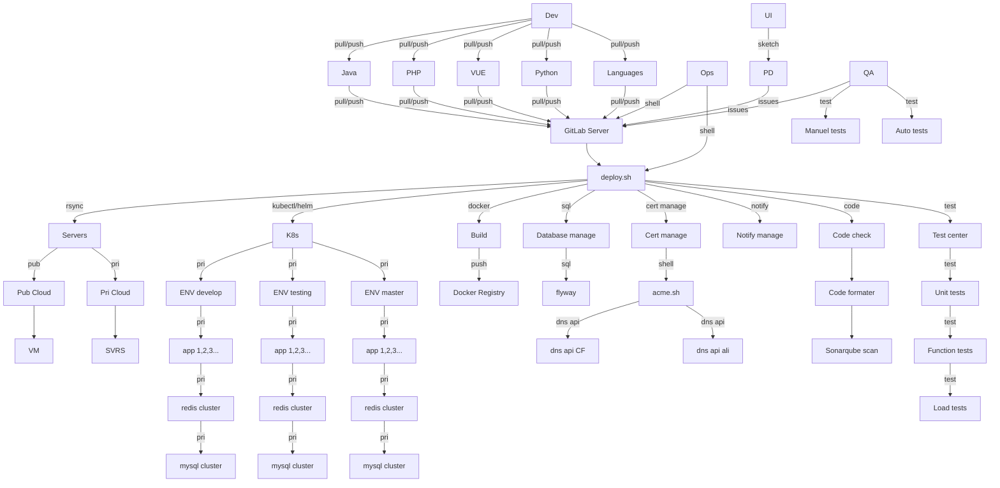

# deploy.sh for GitLab CI/CD

# 中文 [README_zh.md](docs/README_zh.md)

deploy.sh is a CI/CD program for GitLab Server.

# How it works
deploy.sh dependend GitLab and GitLab-Runner.

How to detect program language with deploy.sh:
- node: exist ./package.json or include `project_lang=node` in README.md
- php: exist ./composer.json or include `project_lang=php` in README.md
- java: exist ./pom.xml or include `project_lang=java` in README.md
- python: exist ./requirements.txt or include `project_lang=python` in README.md

# Description
Program Lang: shell
Run Platform: Unix/Linux/MacOS...

# Currently supported
* Cloud vendors: AWS, Aliyun, Qcloud, Huaweicloud...
* Code style: phpcs, phpcbf, java code style, jslint, shfmt, hadolint...
* Code quality: sonarqube scan, OWASP, ZAP, vulmap...
* Unit test: phpunit, junit...
* Build: npm build, composer install, maven build, gradle build, docker build, pip install ...
* Deploy method: rsync+ssh, rsync+nfs,rsync + docker image, rsync jar/war, kubectl, helm...
* Function test: Jmeter, pytest...
* Performance test: stress test, jmeter, loadrunner
* Notify deploy result: work-weixin, Telegram, Element(Matrix), dingding...
* Renew cert: [acme.sh](https://github.com/acmesh-official/acme.sh.git) renew cert for https

# Installation
`git clone https://github.com/xiagw/deploy.sh.git $HOME/runner`

## Quick Start
1. Prepare a gitlab-server and gitlab-runner-server
1. [Install gitlab-runner](https://docs.gitlab.com/runner/install/linux-manually.html), register to gitlab-server, and start gitlab-runner
1. cd $HOME
1. git clone https://github.com/xiagw/deploy.sh.git $HOME/runner
1. cd $HOME/runner
1. cp conf/deploy.conf.example conf/deploy.conf      ## change to yours
1. cp conf/deploy.env.example conf/deploy.env        ## change to yours
1. Refer to conf/.gitlab-ci.yaml of this project, setup yours


## Example step
### Step 1: Prepair Gitlab server
There is already a gitlab server (if not, you can refer to [xiagw/docker-gitlab](https://github.com/xiagw/docker-gitlab) to start one with docker-compose)
### Step 2: Prepair Gitlab Runner
There is already a server that has installed gitlab-runner and register to Gitlab server, (executer is shell)
### Step 3: Prepair Application server
The ssh key file had been prepared, and you can log in to the target server without a password from the gitlab-runner server (the id_rsa file can be in $HOME/.ssh/, or in the deploy.sh/conf/.ssh/)
### Step 4: Clone github
Login to the gitlab-runner server and execute
```
git clone https://github.com/xiagw/deploy.sh.git $HOME/runner
```
### Step 5: Update conf/deploy.conf conf/deploy.env
Refer to the conf/deploy.conf.example conf/deploy.env.example, change to yours configure
```
cd $HOME/runner
cp conf/deploy.conf.example conf/deploy.conf      ## change to yours
cp conf/deploy.env.example conf/deploy.env        ## change to yours
```
### Step 6: Create Gitlab project
For example: created `project-A` under the root account on gitlab-server (root/project-A)
### Step 7: Create .gitlab-ci.yml
Create and submit `.gitlab-ci.yml` on Gitlab `project-A`
### Step 8: Enjoy CI/CD


# The following need "mermain" support


