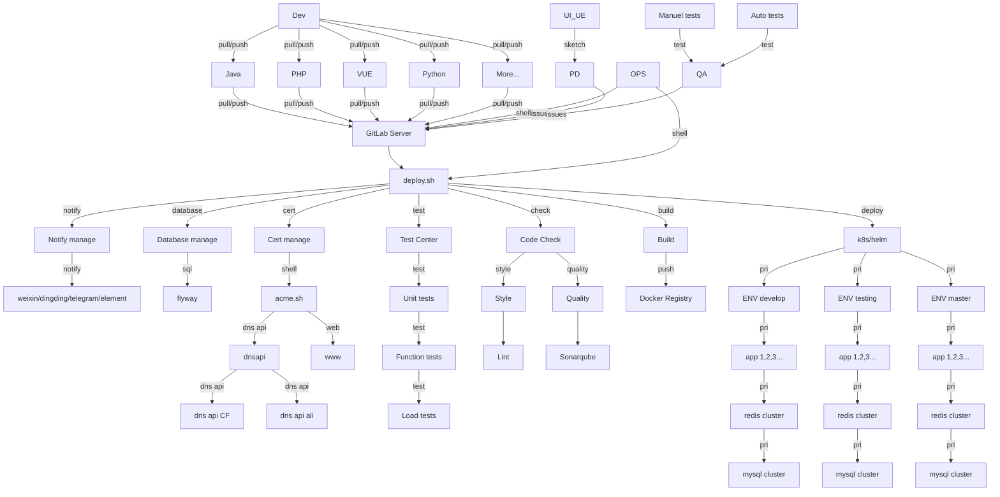

# deploy.sh for CI/CD

# 中文 [README_zh.md](docs/README_zh.md)

# Description
deploy.sh is a general CI/CD program, better than "Buddy".

project_lang=shell

Run Platform: Unix/Linux/MacOS...

It can be executed manually/automated.

It can also be executed with Gitlab/GitLab-Runner, Jenkins, etc.

# How to detect program language
- node: exist package.json or include `project_lang=node` in README.md
- php: exist composer.json or include `project_lang=php` in README.md
- java: exist pom.xml or include `project_lang=java` in README.md
- python: exist requirements.txt or include `project_lang=python` in README.md
- [other]: include `project_lang=[other]` in README.md

# Installation
`git clone https://github.com/xiagw/deploy.sh.git $HOME/runner`

# How to create Helm project
```
bash $HOME/runner/bin/helm-new.sh
## change to yours [$HOME/runner/data/helm/<your_project>]
```

# Currently support
* Cloud vendors: AWS, Aliyun, Qcloud, Huaweicloud...
* Code style: phpcs, phpcbf, java code style, jslint, shfmt, hadolint...
* Code quality: sonarqube scan, OWASP, ZAP, vulmap...
* Unit test: phpunit, junit...
* Build: npm build, composer install, maven build, gradle build, docker build, pip install ...
* Deploy method: rsync+ssh, rsync, rsync + container image, rsync jar/war, ftp, sftp, kubectl, helm...
* Function test: Jmeter, pytest...
* Performance test: stress test, jmeter, loadrunner
* Notify deploy result: work-weixin, Telegram, Element(Matrix), dingding...
* Renew cert: [acme.sh](https://github.com/acmesh-official/acme.sh.git) renew cert for https


## Quick Start
### option [1], Running applications manually
```
## git repo exists
mkdir ~/src
git clone https://github.com/<your_name>/<your_project>.git ~/src/<your_project>
cd ~/src/<your_project>
$HOME/runner/deploy.sh
```
```
## clone git repo by [deploy.sh]
mkdir ~/src
cd ~/src/
$HOME/runner/deploy.sh --git-clone https://github.com/<your_name>/<your_project>.git
```
### option [2], Running applications automated
```
## crontab
*/10 * * * * for d in ~/src/*/; do (cd $d && git pull && $HOME/runner/deploy.sh); done
```
```
## run in Screen or tmux
while true; do for d in ~/src/*/; do (cd $d && git pull && $HOME/runner/deploy.sh); done; sleep 60; done
```

### option [3], Running applications with GitLab-Runner
1. Prepare a gitlab-server and gitlab-runner-server
1. [Install gitlab-runner](https://docs.gitlab.com/runner/install/linux-manually.html), register to gitlab-server, and start gitlab-runner
1. cd $HOME
1. git clone https://github.com/xiagw/deploy.sh.git $HOME/runner
1. cd $HOME/runner
1. cp conf/deploy.conf.example conf/deploy.conf      ## change to yours
1. cp conf/deploy.env.example conf/deploy.env        ## change to yours
1. Refer to conf/.gitlab-ci.yaml of this project, setup yours

### option [4], Running applications with Jenkins
1. Create job,
1. setup job, run custom shell, `bash $HOME/runner/deploy.sh`


## Example step with GitLab Server and GitLab-Runner
### Step 1: Prepair Gitlab server
There is already a gitlab server (if not, you can refer to [xiagw/docker-gitlab](https://github.com/xiagw/docker-gitlab) to start one with docker-compose)
### Step 2: Prepair Gitlab Runner server
There is already a server that has installed gitlab-runner and register to Gitlab server, (executer is shell)
### Step 3: Prepair Application server (*nix/k8s/microk8s/k3s)
The ssh key file had been prepared, and you can login to the target server without a password from the gitlab-runner server (the id_rsa file can be in $HOME/.ssh/, or in the deploy.sh/data/.ssh/)
### Step 4: git clone deploy.sh
SSH login to the gitlab-runner server and execute
```
git clone https://github.com/xiagw/deploy.sh.git $HOME/runner
```
### Step 5: Update conf/deploy.conf, conf/deploy.env
Refer to the conf/deploy.conf.example, conf/deploy.env.example, change to yours configure
```
cd $HOME/runner
cp conf/deploy.conf.example conf/deploy.conf      ## change to yours
cp conf/deploy.env.example conf/deploy.env        ## change to yours
```
### Step 6: Create Gitlab project
For example: created `project-A` under the root account on gitlab-server (root/project-A)
### Step 7: Create .gitlab-ci.yml
Create and submit `.gitlab-ci.yml` on Gitlab `project-A`
### Step 8: Enjoy CI/CD

# Development and Contribution
Welcome create Issue or create PR

[deploy.sh Issue](https://github.com/xiagw/deploy.sh/issues)

[deploy.sh PR](https://github.com/xiagw/deploy.sh/pulls)

# Donation
It would be much appreciated if you want to make a small donation to support my work!
Alipay, WeChat Pay, BitCoin are avaliable for donation. You can chose any of them.

Alipay | WeChat Pay
-|-
|

### Digital Currency:
**BitCoin**

BTC native segwit Address: `bc1qaphg63gygfelzq5ptssv3rq6eayhwclghucf8r`

BTC segwit Address: `3LzwrtqD6av77XVN68UXWLKaHEtAPEQiPt`

**ETH/ERC20**

ETH/ERC20 Address `0x007779971b2Df368E75F1a660c1308A51f45A02e`

**BSC/ERC20**

BSC/ERC20 Address `0x007779971b2Df368E75F1a660c1308A51f45A02e`

**TRX/TRC20**

TRX/TRC20 Address `TAnZ537r98Jo63aKDTfbWmBeooz29ASd73`



