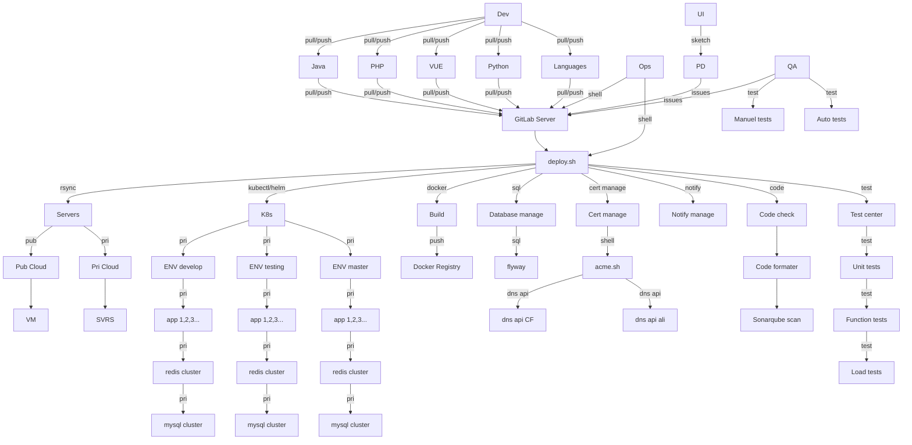

deploy.sh for GitLab CI/CD：

- 支持 阿里云，
- 支持 腾讯云，
- 支持 AWS，
- 支持 直接拷代码文件，
- 支持 docker build image，
- 支持 PHP，Java，Vue，Dockerfile 代码格式化检查，
- 支持 调用acme.sh更新ssl证书
- 支持 调用单元测试
- 支持 调用Sonarqube Scan
- 支持 调用功能自动化测试
- 支持 调用性能压测
- 支持 docker 挂载 nfs，直接部署文件模式
- 支持 Node， npm/yarn，直接部署文件模式
- 支持 Node， docker image 直接部署image模式
- 支持 Java， maven/gradle打包，直接部署jar包文件模式
- 支持 Java， docker image 直接部署image模式
- 支持 PHP， 直接部署文件模式
- 支持 PHP， composer，直接部署文件模式
- 支持 PHP， docker image 直接部署image模式
- 支持 k8s 部署
- 支持 helm 部署
- 支持 普通文件模式部署
- 支持 结果的消息提醒，企业微信，Telegram，Element(Matrix)

# Quick Start
1. 安装操作系统 ubuntu/centos...
1. 安装 gitlab-runner 并且 register it 并且启动 gitlab-runner...
1. cd $HOME
1. git clone https://github.com/xiagw/deploy.sh.git
1. 设置 .gitlab-ci.yaml 于目标git仓库

# 以下显示图片需要 mermain 支持

