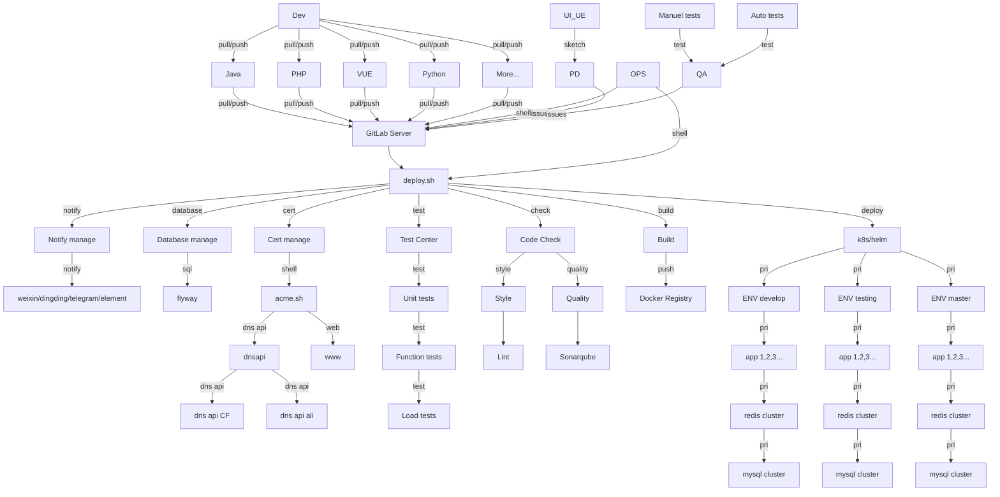

<h1 align="center">
  
  <br>deploy.sh<br>
</h1>

<h4 align="center">An open source CI/CD system</h4>

<p align="center">
  <a href="https://github.com/xiagw/deploy.sh/actions">
    
  </a>
</p>

# 中文 [README_zh.md](README_zh.md)

# Introduction
deploy.sh is a general CI/CD program, better than "Buddy".

It can be executed manually/automated.

It can also be executed with Gitlab/GitLab-Runner, Jenkins, etc.

# Features
* Code style: phpcs, phpcbf, java code style, jslint, shfmt, hadolint...
* Code quality: sonarqube scan, OWASP, ZAP, vulmap...
* Unit test: phpunit, junit...
* Build: npm build, composer install, maven build, gradle build, docker build, pip install ...
* Deploy method: rsync+ssh, rsync, rsync + container image, rsync jar/war, ftp, sftp, kubectl, helm...
* Function test: Jmeter, pytest...
* Performance test: stress test, jmeter, loadrunner
* Notify deploy result: work-weixin, Telegram, Element(Matrix), dingding...
* Renew cert: [acme.sh](https://github.com/acmesh-official/acme.sh.git) renew cert for https
* Cloud vendors: AWS, Aliyun, Qcloud, Huaweicloud...

# Installation
```
git clone --depth 1 https://github.com/xiagw/deploy.sh.git $HOME/runner
```

# How to automatically detect the programming language
- node: exist package.json or include `project_lang=node` in README.md of your project
- php: exist composer.json or include `project_lang=php` in README.md of your project
- java: exist pom.xml or include `project_lang=java` in README.md of your project
- python: exist requirements.txt or include `project_lang=python` in README.md of your project
- [other]: include `project_lang=[other]` in README.md of your project

project_lang=shell

# Quickstart

### option [1]. deploy.sh manually
```
## If your project repository already exists
cd /path/to/<your_project.git>
$HOME/runner/deploy.sh
```

```
## If your project repository dose not exist. (deploy.sh will clone it)
$HOME/runner/deploy.sh --git-clone https://github.com/<some_name>/<some_project>.git
```

### option [2]. deploy.sh automated
```
## crontab
*/5 * * * * for d in /path/to/src/*/; do (cd $d && git pull && $HOME/runner/deploy.sh --cron); done
```
```
## run in screen or tmux
while true; do for d in /path/to/src/*/; do (cd $d && git pull && $HOME/runner/deploy.sh --loop); done; sleep 300; done
```

### option [3]. deploy.sh with GitLab-Runner
1. Prepare a gitlab-server and gitlab-runner-server
1. [Install gitlab-runner](https://docs.gitlab.com/runner/install/linux-manually.html), register to gitlab-server, and start gitlab-runner
1. cd $HOME/runner
1. cp conf/example-deploy.conf data/deploy.conf      ## !!!change to yours!!!
1. cp conf/example-deploy.env data/deploy.env        ## !!!change to yours!!!
1. Refer to conf/.gitlab-ci.yaml of this project, setup \<your_project.git\>/.gitlab-ci.yaml

### option [4]. deploy.sh with Jenkins
1. Create job,
1. setup job, run custom shell, `bash $HOME/runner/deploy.sh`


# Examples (with GitLab Server and GitLab-Runner)

### Step 1: Prepair Gitlab server
There is already a gitlab server (if not, you can refer to [xiagw/docker-gitlab](https://github.com/xiagw/docker-gitlab) to start one with docker-compose)

### Step 2: Prepair Gitlab Runner server
There is already a server that has installed gitlab-runner and register to Gitlab server, (executer is shell)

and make sure gitlab-runner is running properly. `sudo gitlab-runner status`

### Step 3: Prepair Application server (Linux/k8s/microk8s/k3s)
if use rsync+ssh to deploy: The ssh key file had been prepared, and you can login to the Application server without a password from the gitlab-runner server (the key file can be in $HOME/.ssh/, or in the $HOME/runner/data/.ssh/)

if use k8s to deploy: on the gitlab-runner server, prepare ~/.kube/config

### Step 4: install, git clone deploy.sh
SSH login to the gitlab-runner server
```
git clone https://github.com/xiagw/deploy.sh.git $HOME/runner
```

### Step 5: Update $HOME/runner/data/deploy.conf, $HOME/runner/data/deploy.env
Refer to the conf/example-deploy.conf, conf/example-deploy.env, change to yours configure
```
cd $HOME/runner
cp conf/example-deploy.conf data/deploy.conf      ## change to yours
cp conf/example-deploy.env data/deploy.env        ## change to yours
```

### Step 6: Create Gitlab project on gitlab server
Example: created `project-A` under the root account on gitlab-server (root/project-A)

### Step 7: Create root/project-A/.gitlab-ci.yml on gitlab server
Create and submit `.gitlab-ci.yml` on Gitlab `project-A`

### Step 8: Enjoy CI/CD

# FAQ
### How to create Helm files for applications project
If you use helm to deploy to k8s, change helm-new.sh for yours (default open port 8080 and 8081)
```
bash $HOME/runner/bin/helm-new.sh
## change to yours [$HOME/runner/data/helm/<your_project>]
```

### How to resolve gitlab-runner fail
If you use Ubuntu, just `rm -f $HOME/.bash_logout`

# Diagram


# Development and Contribution
Welcome create Issue or create PR

[deploy.sh Issue](https://github.com/xiagw/deploy.sh/issues)

[deploy.sh PR](https://github.com/xiagw/deploy.sh/pulls)

# Donation
It would be much appreciated if you want to make a small donation to support my work!
Alipay, WeChat Pay, BitCoin are avaliable for donation. You can chose any of them.

| Alipay | WeChat Pay |
| ---- | ---- |
|  |  |

### Digital Currency:
**BitCoin**

BTC native segwit Address: `bc1qaphg63gygfelzq5ptssv3rq6eayhwclghucf8r`

BTC segwit Address: `3LzwrtqD6av77XVN68UXWLKaHEtAPEQiPt`

**ETH/ERC20**

ETH/ERC20 Address `0x007779971b2Df368E75F1a660c1308A51f45A02e`

**BSC/ERC20**

BSC/ERC20 Address `0x007779971b2Df368E75F1a660c1308A51f45A02e`

**TRX/TRC20**

TRX/TRC20 Address `TAnZ537r98Jo63aKDTfbWmBeooz29ASd73`


