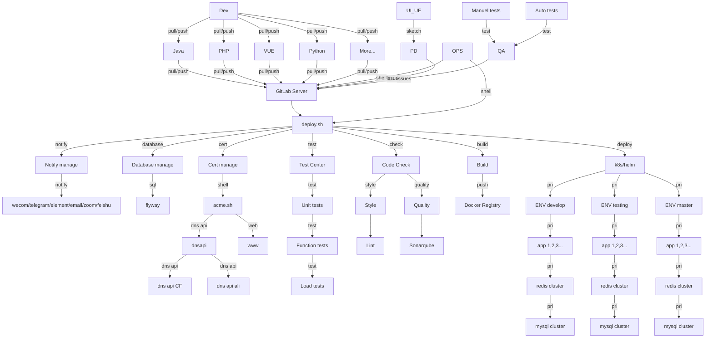

<h1 align="center">
  
  <br>deploy.sh<br>
</h1>

<h4 align="center">An open source CI/CD system</h4>

<p align="center">
  <a href="https://github.com/xiagw/deploy.sh/actions">
    
  </a>
</p>

# 中文 [README_zh.md](README_zh.md)

# Introduction
deploy.sh is a powerful and flexible CI/CD automation tool that can be executed both manually and programmatically.
It seamlessly integrates with popular version control and CI/CD platforms including:

- GitLab/GitLab-Runner
- Jenkins
- Gitea/Act_Runner
- Gogs
- GitHub Actions
- ...

The tool is designed to streamline your deployment workflow while supporting a wide range of deployment scenarios,
from traditional server deployments to modern container orchestration.

# Features
- **Code style**: phpcs+php-cs-fixer, eslint+prettier, pylint+black+isort, gofmt+golangci-lint, rustfmt+clippy, checkstyle, ktlint, shfmt+shellcheck, hadolint, dotnet format...
- **Code quality**: sonarqube, codeclimate, pmd, spotbugs, checkstyle, pylint...
- **Security scan**: semgrep (SAST), trivy (SCA / image), gitleaks (secrets), ZAP / vulmap (DAST)...
- **Testing Suite**: Unit, functional, and performance tests via a repository `Dockerfile.tests` image (or explicit `ENV_TEST_IMAGE`); the test entrypoint is carried by the image CMD/ENTRYPOINT, supporting any framework (phpunit / mvn test / pytest / go test...); all three layers are skipped by default and require explicit opt-in
- **Build**: npm build, composer install, maven build, gradle build, docker build (buildx + bake + BuildKit cache + multi-arch), pip install ...
- **Deploy method**: rsync+ssh, rsync daemon, docker compose, ftp, sftp, kubectl/helm, Aliyun OSS, Aliyun Functions (FC)...
- **Notifications**: Integrated alerts via WeChat Work (WeCom), Telegram, Element(Matrix), Email, Zoom, Feishu
- **SSL/TLS**: Automated certificate management using [acme.sh](https://github.com/acmesh-official/acme.sh.git)
- **Cloud Ready**: AWS, Aliyun, Tencent Cloud, Huawei Cloud...

# Installation
Prerequisites:
- Git
- Bash shell environment

```
git clone --depth 1 https://github.com/xiagw/deploy.sh.git $HOME/runner
```

# How to automatically detect the programming language
| Language | Detection Method |
|----------|------------------|
| java     | Exists pom.xml / build.gradle / gradle.build, or include `project_lang=java` in README.md |
| php      | Exists composer.json, or include `project_lang=php` in README.md |
| node     | Exists package.json, or include `project_lang=node` in README.md |
| python   | Exists requirements.txt / setup.py / Pipfile, or include `project_lang=python` in README.md |
| golang   | Exists go.mod, or include `project_lang=golang` in README.md |
| rust     | Exists Cargo.toml, or include `project_lang=rust` in README.md |
| dotnet   | Exists \*.csproj, or include `project_lang=dotnet` in README.md |
| ruby     | Exists Gemfile / \*.gemspec, or include `project_lang=ruby` in README.md |
| elixir   | Exists mix.exs, or include `project_lang=elixir` in README.md |
| other    | Include `project_lang=[other]` in README.md |

> Note: the marker line below lets deploy.sh detect this repo as a shell project:

project_lang=shell

# Quickstart

### option [1]. deploy.sh manually
```
## If your project repository already exists
cd /path/to/<your_project.git>
$HOME/runner/deploy.sh
```

```
## If your project repository dose not exist. (deploy.sh will clone it)
$HOME/runner/deploy.sh --git-clone https://github.com/<some_name>/<some_project>.git
```

### option [2]. deploy.sh automated
```
## crontab
*/5 * * * * for d in /path/to/src/*/; do (cd $d && git pull && $HOME/runner/deploy.sh --cron); done
```
```
## run in screen or tmux
while true; do for d in /path/to/src/*/; do (cd $d && git pull && $HOME/runner/deploy.sh --loop); done; sleep 300; done
```

### option [3]. deploy.sh with GitLab-Runner
1. Prepare a gitlab-server and gitlab-runner-server; [install gitlab-runner](https://docs.gitlab.com/runner/install/linux-manually.html), register it to gitlab-server (shell executor), and verify with `sudo gitlab-runner status`
1. Refer to `conf/templates/gitlab-ci.yml` to setup `\<your_project.git\>/.gitlab-ci.yml`
1. **Note**: `data/deploy.env` and the project config `data/conf/namespace/project-name.json` are auto-generated from templates on first run — **edit the customization fields (hosts, user, port, rsync_dest, etc.)** before deployment can proceed

### option [4]. deploy.sh with Jenkins
1. Create job,
1. setup job, run custom shell, `bash $HOME/runner/deploy.sh`


# FAQ
### How to create Helm files for applications project
If you use helm to deploy to k8s, the chart is auto-generated during the helm deployment (default open port 8080 and 8081) when missing.

### How to resolve gitlab-runner fail
If you use Ubuntu, just `rm -f $HOME/.bash_logout`

# Diagram

```mermaid
graph TB;

Dev -- pull/push --> Java;
Dev -- pull/push --> PHP;
Dev -- pull/push --> VUE;
Dev -- pull/push --> Python;
Dev -- pull/push --> more[More...];
Java -- pull/push --> GIT;
PHP -- pull/push --> GIT;
VUE -- pull/push --> GIT;
Python -- pull/push --> GIT;
more -- pull/push --> GIT;
GIT --> CICD[deploy.sh];
OPS -- shell --> GIT;
OPS -- shell --> CICD;
UI_UE -- sketch --> PD;
PD -- issues --> GIT[GitLab Server];
QA -- issues--> GIT;
testm[Manuel tests] -- test--> QA;
testa[Auto tests] -- test--> QA;
CICD -- deploy --> K8S[k8s/helm];
CICD -- build --> Build;
CICD -- database --> db1[Database manage];
CICD -- cert --> cert[Cert manage];
CICD -- notify --> notify[Notify manage];
CICD -- check --> rev[Code Check];
CICD -- test --> test[Test Center];
notify -- notify --> wecom/telegram/element/email/zoom/feishu;
db1 -- sql --> flyway;
cert -- shell --> acme[acme.sh];
acme -- dns api --> dnsapi;
acme -- web --> www;
dnsapi -- dns api --> dns1[dns api CF];
dnsapi -- dns api --> dns2[dns api ali];
test -- test --> testu[Unit tests];
testu -- test --> testf[Function tests];
testf -- test --> testl[Load tests];
rev -- style --> format[Style];
format --> Lint;
rev -- quality--> quality[Quality];
quality --> Sonarqube;
Build -- push --> Repo[Docker Registry];
K8S -- pri --> ENV_D[ENV develop];
K8S -- pri --> ENV_T[ENV testing];
K8S -- pri --> ENV_M[ENV master];
ENV_D -- pri --> app_d[app 1,2,3...];
app_d -- pri --> cache_d[redis cluster];
cache_d -- pri --> db_d[mysql cluster];
ENV_T -- pri --> app_t[app 1,2,3...];
app_t -- pri --> cache_t[redis cluster];
cache_t -- pri --> db_t[mysql cluster];
ENV_M -- pri --> app_m[app 1,2,3...];
app_m -- pri --> cache_m[redis cluster];
cache_m -- pri --> db_m[mysql cluster];
```

# Contributing
We welcome contributions to deploy.sh!

Please make sure to update tests as appropriate and adhere to the project's coding standards.

[deploy.sh Issue](https://github.com/xiagw/deploy.sh/issues)

[deploy.sh PR](https://github.com/xiagw/deploy.sh/pulls)

# Donation
If you find this project helpful, consider making a small donation to support its development:

| Alipay | WeChat Pay |
| ---- | ---- |
|  |  |

### Digital Currency:
**BitCoin**

BTC native segwit Address: `bc1qaphg63gygfelzq5ptssv3rq6eayhwclghucf8r`

BTC segwit Address: `3LzwrtqD6av77XVN68UXWLKaHEtAPEQiPt`

**ETH/ERC20**

ETH/ERC20 Address `0x007779971b2Df368E75F1a660c1308A51f45A02e`

**BSC/ERC20**

BSC/ERC20 Address `0x007779971b2Df368E75F1a660c1308A51f45A02e`

**TRX/TRC20**

TRX/TRC20 Address `TAnZ537r98Jo63aKDTfbWmBeooz29ASd73`


