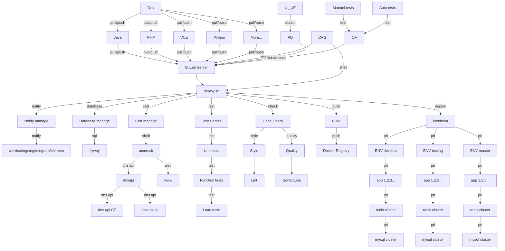

<h1 align="center">
  
  <br>deploy.sh<br>
</h1>

<h4 align="center">An open source CI/CD system</h4>

<p align="center">
  <a href="https://github.com/xiagw/deploy.sh/actions">
    
  </a>
</p>

# 英文 [README.md](README.md)

# 描述信息
deploy.sh 是一个通用的持续集成/持续发布系统，胜过"Buddy"。

可以手动单独运行/或全自动运行。

亦可以配合 GitLab/GitLab-Runner, Jenkins, crontab 等全自动运行。

# 功能支持
* 代码格式规范: phpcs, phpcbf, java code style, jslint, shfmt, hadolint...
* 代码质量扫描/探测: sonarqube scan, OWASP, ZAP, vulmap...
* 单元测试: phpunit, junit...
* 扩展安装/编译/打包: npm build, composer install, maven build, gradle build, docker build, pip install ...
* 发布方式: rsync+ssh, rsync,rsync + container image, rsync jar/war, ftp, sftp, kubectl, helm...
* 功能测试: Jmeter, pytest...
* 性能测试: stress test, jmeter, loadrunner
* 发布结果提醒到聊天软件: 企业微信, Telegram, Element(Matrix), 钉钉...
* 全自动更新证书: [acme.sh](https://github.com/acmesh-official/acme.sh.git) renew cert for https
* 云厂商: AWS, Aliyun, Qcloud, Huaweicloud...

# 安装
```
git clone --depth 1 https://github.com/xiagw/deploy.sh.git $HOME/runner
```

# deploy.sh 如何探测程序开发语言
- node: git库存在`package.json`或在 README.md 包含文本 `project_lang=node`
- php: git库存在`composer.json`或在 README.md 包含文本 `project_lang=php`
- java: git库存在`pom.xml`或在 README.md 包含文本 `project_lang=java`
- python: git库存在`requirements.txt`或在 README.md 包含文本 `project_lang=python`
- [other]: git库内 README.md 包含文本 `project_lang=[other]`

project_lang=shell

## 快速开始

### 可选方式 [1], 手动单独运行
```
## 如果您的项目 git 仓库已预先存在，进入到仓库目录直接运行 [deploy.sh]
cd /path/to/<your_project.git>
$HOME/runner/deploy.sh
```

```
## 如果您的项目 git 仓库不存在，使用 [deploy.sh] 克隆 git 仓库
$HOME/runner/deploy.sh --git-clone https://github.com/<some_name>/<some_project>.git
```

### 可选方式 [2], 通过 crontab 或 Screen/tmux 等方式自动运行
```
## crontab
*/5 * * * * for d in /path/to/src/*/; do (cd $d && git pull && $HOME/runner/deploy.sh --cron); done
```
```
## run in screen or tmux
while true; do for d in /path/to/src/*/; do (cd $d && git pull && $HOME/runner/deploy.sh --loop); done; sleep 300; done
```

### 可选方式 [3], 配合 GitLab-Runner 运行
1. 准备 Gitlab 服务器和 Gitlab-runner 服务器
1. [安装 Gitlab-runner](https://docs.gitlab.com/runner/install/linux-manually.html), 按照文档注册 Gitlab-runner 到 Gitlab 服务器，并启动 Gitlab-runner
1. cd $HOME/runner
1. cp conf/example-deploy.conf data/deploy.conf      ## ！！！修改为你的自定义配置！！！
1. cp conf/example-deploy.env data/deploy.env        ## ！！！修改为你的自定义配置！！！
1. 参考本项目的配置文件 conf/.gitlab-ci.yaml， 设置你的应用 git 仓库当中的文件 \<your_project.git\>.gitlab-ci.yaml

### 可选方式 [4], 配合 Jenkins 运行
1. Create job,
1. 设置任务, run custom shell, `bash $HOME/runner/deploy.sh`


# 实际案例 (配合 GitLab Server and GitLab-Runner)

### Step 1: 准备 Gitlab 服务器
已经准备好 Gitlab 服务器 (如果没有？可以参考[xiagw/docker-gitlab](https://github.com/xiagw/docker-gitlab) 启动一个新服务器)

### Step 2: 准备 Gitlab-runner 服务器
已经安装准备 Gitlab-runner 服务器，已注册到 Gitlab 服务器，并启动 Gitlab-runner(executer is shell)

并且确认一下运行状态。 `sudo gitlab-runner status`

### Step 3: 准备应用程序服务器 (*nix/k8s/microk8s/k3s)
如果您打算使用 rsync+ssh 的方式发布：准备好 ssh public key, 并可以无密码登录到应用程序服务器 (ssh private key 可以存放于 $HOME/.ssh/ 或 $HOME/runner/data/.ssh/)

如果您打算使用 k8s 的方式发布：准备好 ~/.kube/config 等配置文件

### Step 4: 安装 deploy.sh
ssh 登录进入 Gitlab-runner 服务器，并执行以下命令用来安装 deploy.sh
```
git clone https://github.com/xiagw/deploy.sh.git $HOME/runner
```

### Step 5: 更新配置文件 data/deploy.conf， data/deploy.env
参考 conf/example-deploy.conf, conf/example-deploy.env, 修改为你的自定义配置
```
cd $HOME/runner
cp conf/example-deploy.conf data/deploy.conf      ## 修改为你的自定义配置
cp conf/example-deploy.env data/deploy.env        ## 修改为你的自定义配置
```

### Step 6: 创建 Gitlab git 仓库
登录进入 Gitlab 服务器，并创建一个 git 仓库 `project-A` (例如 root/project-A)

### Step 7: 创建 .gitlab-ci.yml
创建并提交一个文件 `.gitlab-ci.yml` 在 git 仓库 `project-A`

### Step 8: 享受 CI/CD

# FAQ
### 如何创建 helm 项目文件
如果你使用 helm 来部署到 k8s, 可以修改 helm-new.sh 匹配你的需求 （默认开启 8080 和 8081 端口）
```
bash $HOME/runner/bin/helm-new.sh
## change to yours [$HOME/runner/data/helm/<your_project>]
```

### 如何解决 gitlab-runner 运行失败
假如你使用 Ubuntu, just `rm -f $HOME/.bash_logout`

# 流程图


# 开发和贡献
欢迎提 Issue 或提交 PR

[deploy.sh Issue](https://github.com/xiagw/deploy.sh/issues)

[deploy.sh PR](https://github.com/xiagw/deploy.sh/pulls)

# 捐赠
假如您觉得这个项目对您有用，望不吝捐赠一下。
支持 支付宝/微信支付/数字币支付 等方式。

| Alipay | WeChat Pay |
| ---- | ---- |
|  |  |

### 数字币:
**比特币**

BTC native segwit Address: `bc1qaphg63gygfelzq5ptssv3rq6eayhwclghucf8r`

BTC segwit Address: `3LzwrtqD6av77XVN68UXWLKaHEtAPEQiPt`

**以太币/USDT，ETH/ERC20**

ETH/ERC20 Address `0x007779971b2Df368E75F1a660c1308A51f45A02e`

**币安，BSC/ERC20**

BSC/ERC20 Address `0x007779971b2Df368E75F1a660c1308A51f45A02e`

**波场/USDT，TRX/TRC20**

TRX/TRC20 Address `TAnZ537r98Jo63aKDTfbWmBeooz29ASd73`


