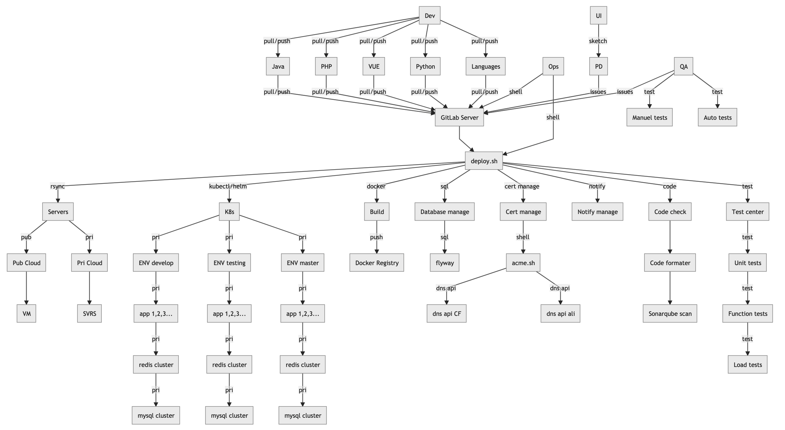
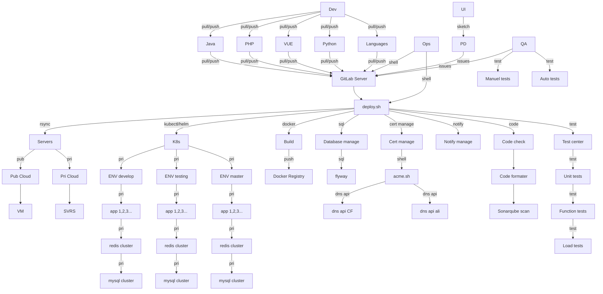

deploy.sh for GitLab CI/CD：

- 支持 阿里云，腾讯云，AWS，
- 支持 直接拷代码文件，
- 支持 docker build image，
- 支持 PHP，Java，Vue，Dockerfile 代码格式化检查，
- 支持 调用acme.sh更新ssl证书
- 支持 调用单元测试
- 支持 调用Sonarqube Scan
- 支持 调用功能自动化测试
- 支持 调用性能压测，例如 jmeter 之类
- 支持 docker 挂载 nfs，直接部署文件模式
- Node， npm/yarn，直接部署文件模式
- Node， docker image 直接部署image模式
- Java， maven/gradle打包，直接部署jar包文件模式
- Java， docker image 直接部署image模式
- PHP， 直接部署文件模式
- PHP， composer，直接部署文件模式
- PHP， docker image 直接部署image模式
- 支持 k8s 部署
- 支持 helm 部署
- 支持 普通文件模式部署
- 支持 结果的消息提醒，企业微信，Telegram，Element(Matrix)

# Quick Start
1. 安装 gitlab-runner 并且 register it 并且启动 gitlab-runner
1. cd $HOME
1. git clone https://github.com/xiagw/deploy.sh.git $HOME/runner
1. 拷贝 deploy.conf 为 .deploy.conf （修改为你的配置）
1. 拷贝 deploy.env 为 .deploy.env（修改为你的配置）
1. 参看本项目 .gitlab-ci.yaml 设置于目标git仓库
1. 目标git仓库提交/push代码

# 实例：
1. 已有一台服务器 gitlab ，（如果没有，可以参考 [xiagw/gitlab-docker](https://github.com/xiagw/docker-gitlab) 用 docker-compose up -d gitlab 启动一台）
1. 已有一台服务器已经安装好 gitlab-runner，并且是默认安装（executer 为 shell）
1. 已经准备好 ssh key file，从 gitlab-runner 服务器可以无密码登录到目标服务器，（id_rsa文件可以在 $HOME/.ssh/，也可以在 deploy.sh/.ssh/ 目录）
1. 登录到 gitlab-runner 服务器，执行
`git clone https://github.com/xiagw/deploy.sh.git $HOME/runner`
1. 参照 deploy.conf, deploy.env 例子修改好文件
 `cd runner && cp deploy.conf .deploy.conf && cp deploy.env .deploy.env
`
1. 例如 gitlab 已经建立 projectA 在 root 账号下面
1. 在 projectA 修改代码，
1. 并创建 .gitlab-ci.yml ，（同样可以参照本项目的.gitlab-ci.yml）
1. 提交并push代码即可自动 CI/CD

# 以下显示图片需要 mermain 支持

