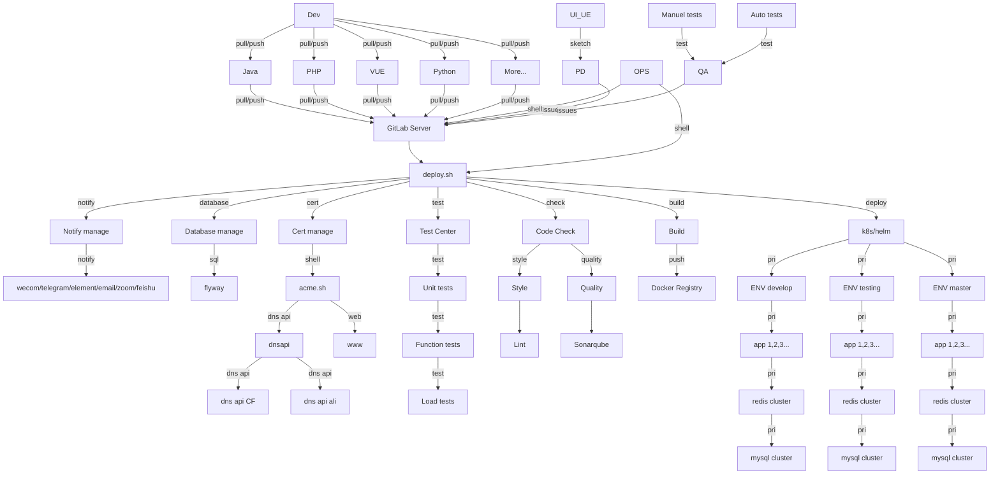

<h1 align="center">
  
  <br>deploy.sh<br>
</h1>

<h4 align="center">An open source CI/CD system</h4>

<p align="center">
  <a href="https://github.com/xiagw/deploy.sh/actions">
    
  </a>
</p>

# 英文 [README.md](README.md)

# 描述信息
deploy.sh 是一个强大而灵活的持续集成/发布系统，旨在简化和自动化软件开发流程。它支持多种开发语言和部署方式，可以单独运行或与其他CI/CD工具集成，支持手动和自动发布，支持GitLab, GitLab-Runner, Gitea/Act_Runner, Jenkins, crontab, Screen/tmux 等多种运行方式，是大中小企业开发团队的理想选择。

# 功能支持
- 代码格式规范: phpcs+php-cs-fixer, eslint+prettier, pylint+black+isort, gofmt+golangci-lint, rustfmt+clippy, checkstyle, ktlint, shfmt+shellcheck, hadolint, dotnet format...
- 代码质量与安全扫描: sonarqube, codeclimate, pmd, spotbugs, checkstyle, pylint（代码质量）; semgrep(SAST), trivy(SCA/镜像), gitleaks(密钥), ZAP, vulmap(DAST)...
- 单元测试: 构建并运行仓库中的 `Dockerfile.tests` 测试镜像（或显式指定 `ENV_TEST_IMAGE`），测试入口由镜像 CMD/ENTRYPOINT 承载，内置任意框架（phpunit / mvn test / gradle test / npm test / pytest / go test 等）
- 构建/编译/打包: npm build, composer install, maven build, gradle build, docker build (buildx/bake/构建缓存/多架构), pip install ...
- 发布方式: rsync+ssh, rsync daemon, docker compose, ftp, sftp, kubectl/helm, 阿里云 OSS, 阿里云函数计算 (FC)...
- 功能测试: 同一个 `Dockerfile.tests` 测试镜像（部署后冒烟/验收），默认跳过需显式启用
- 性能测试: 同样容器执行（k6 / jmeter 等引擎由测试镜像自身承载），默认跳过需显式启用
- 发布结果通知: 企业微信, Telegram, Element(Matrix), Email, Zoom, 飞书...
- 全自动更新证书: [acme.sh](https://github.com/acmesh-official/acme.sh.git) renew cert for https
- 云平台支持: AWS, Aliyun, Qcloud, Huaweicloud...

# 安装
## 前置条件
- Git
- Bash shell
- SSH (可选，用于远程部署)

```bash
git clone --depth 1 https://github.com/xiagw/deploy.sh.git $HOME/runner
```

# deploy.sh 如何探测程序开发语言

| 语言 | 探测方式 |
|------|----------|
| java | 存在`pom.xml`/`build.gradle`/`gradle.build`或README.md包含`project_lang=java` |
| php | 存在`composer.json`或README.md包含`project_lang=php` |
| node | 存在`package.json`或README.md包含`project_lang=node` |
| python | 存在`requirements.txt`/`setup.py`/`Pipfile`或README.md包含`project_lang=python` |
| golang | 存在`go.mod`或README.md包含`project_lang=golang` |
| rust | 存在`Cargo.toml`或README.md包含`project_lang=rust` |
| dotnet | 存在`*.csproj`或README.md包含`project_lang=dotnet` |
| ruby | 存在`Gemfile`/`*.gemspec`或README.md包含`project_lang=ruby` |
| elixir | 存在`mix.exs`或README.md包含`project_lang=elixir` |
| 其他 | README.md包含`project_lang=[other]` |

> 说明：以下标记行供 deploy.sh 将本仓库识别为 shell 项目：

project_lang=shell

## 快速开始

### 可选方式 [1], 手动单独运行
```bash
## 如果您的项目 git 仓库已预先存在，进入到仓库目录直接运行 deploy.sh
$HOME/runner/deploy.sh -w /path/to/<your_project.git>
## 或者
cd /path/to/<your_project.git> && $HOME/runner/deploy.sh
## 如果您的项目 git 仓库不存在，使用 deploy.sh 克隆 git 仓库
$HOME/runner/deploy.sh --git-clone https://github.com/<some_name>/<some_project>.git
```

### 可选方式 [2], 通过 crontab 或 Screen/tmux 等方式自动运行
```bash
## crontab
*/5 * * * * for d in /path/to/src/*/; do (cd $d && git pull && $HOME/runner/deploy.sh --cron); done
```
```bash
## run in screen or tmux
while true; do for d in /path/to/src/*/; do (cd $d && git pull && $HOME/runner/deploy.sh --loop); done; sleep 300; done
```

### 可选方式 [3], 配合 GitLab-Runner 运行
1. 准备 Gitlab 服务器和 Gitlab-runner 服务器，[安装并注册 Gitlab-runner](https://docs.gitlab.com/runner/install/linux-manually.html)（executor 为 shell），`sudo gitlab-runner status` 确认运行
1. 参考 `conf/templates/gitlab-ci.yml`，在你的应用仓库中创建 `.gitlab-ci.yml`
1. **注意**：环境配置 `data/deploy.env` 与项目配置 `data/conf/namespace/project-name.json` 会在首次运行时自动从模板生成，**必须修改其中的自定义配置（hosts、user、port、rsync_dest 等）**后才能继续部署

### 可选方式 [4], 配合 Jenkins 运行
1. Create job,
1. 设置任务, run custom shell, `bash $HOME/runner/deploy.sh`


# FAQ
### 如何创建 helm 项目文件
如果使用 helm 部署到 k8s，chart 会在 helm 部署过程中缺失时自动生成（默认开启 8080 和 8081 端口）。

### 如何解决 gitlab-runner 运行失败
假如你使用 Ubuntu, just `rm -f $HOME/.bash_logout`

# 流程图

```mermaid
graph TB;

Dev -- pull/push --> Java;
Dev -- pull/push --> PHP;
Dev -- pull/push --> VUE;
Dev -- pull/push --> Python;
Dev -- pull/push --> more[More...];
Java -- pull/push --> GIT;
PHP -- pull/push --> GIT;
VUE -- pull/push --> GIT;
Python -- pull/push --> GIT;
more -- pull/push --> GIT;
GIT --> CICD[deploy.sh];
OPS -- shell --> GIT;
OPS -- shell --> CICD;
UI_UE -- sketch --> PD;
PD -- issues --> GIT[GitLab Server];
QA -- issues--> GIT;
testm[Manuel tests] -- test--> QA;
testa[Auto tests] -- test--> QA;
CICD -- deploy --> K8S[k8s/helm];
CICD -- build --> Build;
CICD -- database --> db1[Database manage];
CICD -- cert --> cert[Cert manage];
CICD -- notify --> notify[Notify manage];
CICD -- check --> rev[Code Check];
CICD -- test --> test[Test Center];
notify -- notify --> wecom/telegram/element/email/zoom/feishu;
db1 -- sql --> flyway;
cert -- shell --> acme[acme.sh];
acme -- dns api --> dnsapi;
acme -- web --> www;
dnsapi -- dns api --> dns1[dns api CF];
dnsapi -- dns api --> dns2[dns api ali];
test -- test --> testu[Unit tests];
testu -- test --> testf[Function tests];
testf -- test --> testl[Load tests];
rev -- style --> format[Style];
format --> Lint;
rev -- quality--> quality[Quality];
quality --> Sonarqube;
Build -- push --> Repo[Docker Registry];
K8S -- pri --> ENV_D[ENV develop];
K8S -- pri --> ENV_T[ENV testing];
K8S -- pri --> ENV_M[ENV master];
ENV_D -- pri --> app_d[app 1,2,3...];
app_d -- pri --> cache_d[redis cluster];
cache_d -- pri --> db_d[mysql cluster];
ENV_T -- pri --> app_t[app 1,2,3...];
app_t -- pri --> cache_t[redis cluster];
cache_t -- pri --> db_t[mysql cluster];
ENV_M -- pri --> app_m[app 1,2,3...];
app_m -- pri --> cache_m[redis cluster];
cache_m -- pri --> db_m[mysql cluster];
```

# 开发和贡献
我们欢迎并感谢任何形式的贡献！

欢迎提 Issue 或提交 PR：
- [deploy.sh Issue](https://github.com/xiagw/deploy.sh/issues)
- [deploy.sh PR](https://github.com/xiagw/deploy.sh/pulls)

# 捐赠
假如您觉得这个项目对您有用，望不吝捐赠一下。支持 支付宝/微信支付/数字币支付 等方式。

<div style="display: flex; justify-content: space-around;">
  
  
</div>

### 数字币:
**比特币**
BTC native segwit Address: `bc1qaphg63gygfelzq5ptssv3rq6eayhwclghucf8r`
BTC segwit Address: `3LzwrtqD6av77XVN68UXWLKaHEtAPEQiPt`

**以太币/USDT，ETH/ERC20**
ETH/ERC20 Address `0x007779971b2Df368E75F1a660c1308A51f45A02e`

**币安，BSC/ERC20**
BSC/ERC20 Address `0x007779971b2Df368E75F1a660c1308A51f45A02e`

**波场/USDT，TRX/TRC20**
TRX/TRC20 Address `TAnZ537r98Jo63aKDTfbWmBeooz29ASd73`

# 许可证
本项目采用 MIT 许可证。查看 [LICENSE](LICENSE) 文件了解更多信息。
