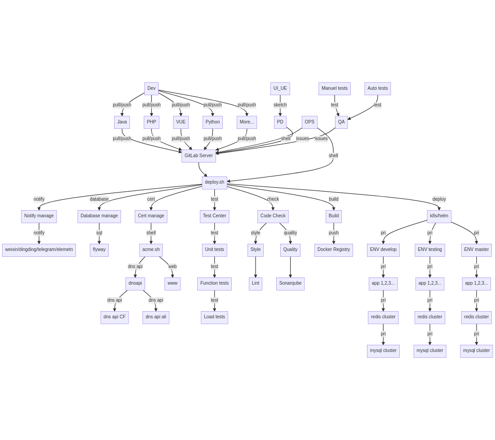
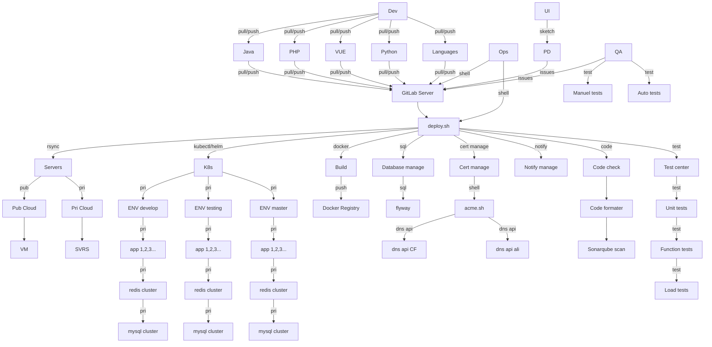

# deploy.sh 用于 GitLab 持续集成/持续发布

deploy.sh 是 Gitlab 持续集成/持续发布系统

# 如何运行
deploy.sh 依赖于 GitLab 和 GitLab-Runner.

deploy.sh 如何探测程序开发语言:
- node: 存在 ./package.json 或包含文本 `project_lang=node` 在 README.md
- php: 存在 ./composer.json 或包含文本 `project_lang=php` 在 README.md
- java: 存在 ./pom.xml 或包含文本 `project_lang=java` 在 README.md
- python: 存在 ./requirements.txt 或包含文本 `project_lang=python` 在 README.md

# 描述
开发语言： shell

运行平台： Unix/Linux/MacOS...

# 支持
* 云厂商: AWS, Aliyun, Qcloud, Huaweicloud...
* 代码格式规范: phpcs, phpcbf, java code style, jslint, shfmt, hadolint...
* 代码质量扫描/探测: sonarqube scan, OWASP, ZAP, vulmap...
* 单元测试: phpunit, junit...
* 扩展安装/编译/打包: npm build, composer install, maven build, gradle build, docker build, pip install ...
* 发布方式: rsync+ssh, rsync+nfs,rsync + docker image, rsync jar/war, kubectl, helm...
* 功能测试: Jmeter, pytest...
* 性能测试: stress test, jmeter, loadrunner
* 发布结果提醒: work-weixin, Telegram, Element(Matrix), dingding...
* 更新证书: [acme.sh](https://github.com/acmesh-official/acme.sh.git) renew cert for https

# 安装
`git clone https://github.com/xiagw/deploy.sh.git $HOME/runner`

## 快速开始
1. 准备 Gitlab 服务器和 Gitlab-runner 服务器
1. [安装 Gitlab-runner](https://docs.gitlab.com/runner/install/linux-manually.html), 按照文档注册 Gitlab-runner 到 Gitlab 服务器，并启动 Gitlab-runner
1. cd $HOME
1. git clone https://github.com/xiagw/deploy.sh.git $HOME/runner
1. cd $HOME/runner
1. cp conf/deploy.conf.example conf/deploy.conf      ## 修改为你的自定义配置
1. cp conf/deploy.env.example conf/deploy.env        ## 修改为你的自定义配置
1. 参考本项目的配置文件 conf/.gitlab-ci.yaml


## 实际案例
### Step 1: 准备 Gitlab 服务器
已经准备好 Gitlab 服务器 (如果没有？可以参考[xiagw/docker-gitlab](https://github.com/xiagw/docker-gitlab) 启动一个新服务器)
### Step 2: 准备 Gitlab-runner 服务器
已经安装准备 Gitlab-runner 服务器，已注册到 Gitlab 服务器，并启动 Gitlab-runner(executer is shell)
### Step 3: 准备应用程序服务器 (*nix/k8s/microk8s/k3s)
准备好 ssh public key, 并可以无密码登录到应用程序服务器 (ssh private key 可以存放于 $HOME/.ssh/ 或 deploy.sh/conf/.ssh/)
### Step 4: 安装 deploy.sh
ssh 登录进入 Gitlab-runner 服务器，并执行以下命令用来安装 deploy.sh
```
git clone https://github.com/xiagw/deploy.sh.git $HOME/runner
```
### Step 5: 更新配置文件 conf/deploy.conf， conf/deploy.env
参考 conf/deploy.conf.example, conf/deploy.env.example, 修改为你的自定义配置
```
cd $HOME/runner
cp conf/deploy.conf.example conf/deploy.conf      ## 修改为你的自定义配置
cp conf/deploy.env.example conf/deploy.env        ## 修改为你的自定义配置
```
### Step 6: 创建 Gitlab git 仓库
登录进入 Gitlab 服务器，并创建一个 git 仓库 `project-A` (root/project-A)
### Step 7: 创建 .gitlab-ci.yml
创建并提交一个文件 `.gitlab-ci.yml` 在 git 仓库 `project-A`
### Step 8: 享受 CI/CD


# 以下代码需要支持 "mermain" 语法的浏览器才能显示图片


