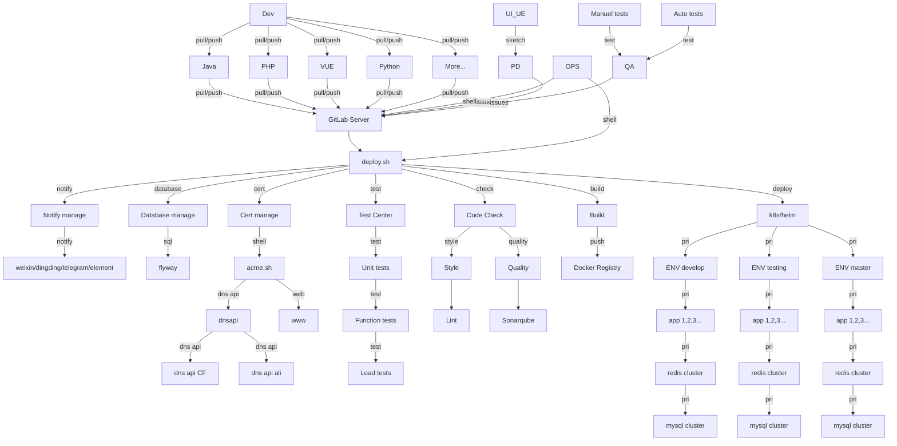

# deploy.sh for CI/CD

# 英文 [README.md](../README.md)

# 描述信息
deploy.sh 是一个通用的持续集成/持续发布系统，胜过"Buddy"。

project_lang=shell

运行平台： Unix/Linux/MacOS...

可以手动单独运行或全自动运行。

亦可以配合 GitLab/GitLab-Runner, Jenkins 等全自动运行。

# 如何探测程序开发语言
- node: git仓库内存在 package.json 或包含文本 `project_lang=node` 在 README.md
- php: git仓库内存在 composer.json 或包含文本 `project_lang=php` 在 README.md
- java: git仓库内存在 pom.xml 或包含文本 `project_lang=java` 在 README.md
- python: git仓库内存在 requirements.txt 或包含文本 `project_lang=python` 在 README.md
- other: git仓库内README.md包含文本 `project_lang=other`

# 支持
* 云厂商: AWS, Aliyun, Qcloud, Huaweicloud...
* 代码格式规范: phpcs, phpcbf, java code style, jslint, shfmt, hadolint...
* 代码质量扫描/探测: sonarqube scan, OWASP, ZAP, vulmap...
* 单元测试: phpunit, junit...
* 扩展安装/编译/打包: npm build, composer install, maven build, gradle build, docker build, pip install ...
* 发布方式: rsync+ssh, rsync,rsync + container image, rsync jar/war, ftp, sftp, kubectl, helm...
* 功能测试: Jmeter, pytest...
* 性能测试: stress test, jmeter, loadrunner
* 发布结果提醒到聊天软件: 企业微信, Telegram, Element(Matrix), 钉钉...
* 全自动更新证书: [acme.sh](https://github.com/acmesh-official/acme.sh.git) renew cert for https

# 安装
`git clone https://github.com/xiagw/deploy.sh.git $HOME/runner`

## 快速开始
### 可选项 [1], 手动单独运行程序
```
## git 仓库已预先存在，在仓库目录直接运行 deploy.sh
mkdir ~/src
git clone https://github.com/<your_name>/<your_project>.git ~/src/<your_project>
cd ~/src/<your_project>
$HOME/runner/deploy.sh
```
```
## 使用 [deploy.sh] 克隆 git 仓库
mkdir ~/src
cd ~/src/
$HOME/runner/deploy.sh --git-clone https://github.com/<your_name>/<your_project>.git
```
### 可选项 [2], 通过 crontab 或 Screen/tmux 等调用全自动运行程序
```
## crontab
*/10 * * * * for d in ~/src/*/; do (cd $d && git pull && $HOME/runner/deploy.sh); done
```
```
## run in Screen or tmux
while true; do for d in ~/src/*/; do (cd $d && git pull && $HOME/runner/deploy.sh); done; sleep 60; done
```

### 可选项 [3], 配合 GitLab-Runner 运行程序
1. 准备 Gitlab 服务器和 Gitlab-runner 服务器
1. [安装 Gitlab-runner](https://docs.gitlab.com/runner/install/linux-manually.html), 按照文档注册 Gitlab-runner 到 Gitlab 服务器，并启动 Gitlab-runner
1. cd $HOME
1. git clone https://github.com/xiagw/deploy.sh.git $HOME/runner
1. cd $HOME/runner
1. cp conf/deploy.conf.example conf/deploy.conf      ## 修改为你的自定义配置
1. cp conf/deploy.env.example conf/deploy.env        ## 修改为你的自定义配置
1. 参考本项目的配置文件 conf/.gitlab-ci.yaml

### 可选项 [4], 配合 Jenkins 运行程序
1. 创建任务,
1. 设置任务，运行自定义 shell, `bash $HOME/runner/deploy.sh`


## 实际案例，配合 GitLab Server and GitLab-Runner
### Step 1: 准备 Gitlab 服务器
已经准备好 Gitlab 服务器 (如果没有？可以参考[xiagw/docker-gitlab](https://github.com/xiagw/docker-gitlab) 启动一个新服务器)
### Step 2: 准备 Gitlab-runner 服务器
已经安装准备 Gitlab-runner 服务器，已注册到 Gitlab 服务器，并启动 Gitlab-runner(executer is shell)
### Step 3: 准备应用程序服务器 (*nix/k8s/microk8s/k3s)
准备好 ssh public key, 并可以无密码登录到应用程序服务器 (ssh private key 可以存放于 $HOME/.ssh/ 或 deploy.sh/data/.ssh/)
### Step 4: 安装 deploy.sh
ssh 登录进入 Gitlab-runner 服务器，并执行以下命令用来安装 deploy.sh
```
git clone https://github.com/xiagw/deploy.sh.git $HOME/runner
```
### Step 5: 更新配置文件 conf/deploy.conf， conf/deploy.env
参考 conf/deploy.conf.example, conf/deploy.env.example, 修改为你的自定义配置
```
cd $HOME/runner
cp conf/deploy.conf.example conf/deploy.conf      ## 修改为你的自定义配置
cp conf/deploy.env.example conf/deploy.env        ## 修改为你的自定义配置
```
### Step 6: 创建 Gitlab git 仓库
登录进入 Gitlab 服务器，并创建一个 git 仓库 `project-A` (root/project-A)
### Step 7: 创建 .gitlab-ci.yml
创建并提交一个文件 `.gitlab-ci.yml` 在 git 仓库 `project-A`
### Step 8: 享受 CI/CD

# 开发和贡献
欢迎提 Issue 或提交 PR

[deploy.sh Issue](https://github.com/xiagw/deploy.sh/issues)

[deploy.sh PR](https://github.com/xiagw/deploy.sh/pulls)

# 捐赠
假如您觉得这个项目对您有用，望不吝捐赠一下。
支持 支付宝/微信支付/数字币支付 等方式。

Alipay | WeChat Pay
-|-
|

### 数字币:
**比特币**

BTC native segwit Address: `bc1qaphg63gygfelzq5ptssv3rq6eayhwclghucf8r`

BTC segwit Address: `3LzwrtqD6av77XVN68UXWLKaHEtAPEQiPt`

**以太币/USDT，ETH/ERC20**

ETH/ERC20 Address `0x007779971b2Df368E75F1a660c1308A51f45A02e`

**币安，BSC/ERC20**

BSC/ERC20 Address `0x007779971b2Df368E75F1a660c1308A51f45A02e`

**波场/USDT，TRX/TRC20**

TRX/TRC20 Address `TAnZ537r98Jo63aKDTfbWmBeooz29ASd73`


# 以下代码需要支持 "[mermain](https://mermaid-js.github.io/mermaid/#/README)" 语法的浏览器才能显示图片



