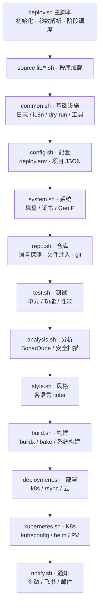

# deploy.sh 架构说明（deploy.sh + lib/）

> 本文件从**功能 / 流程 / 逻辑 / 提示**四个维度梳理 deploy.sh 与其 lib/ 模块。
> 配套文档见文末「关联文档」。

---

## 1. 总览

deploy.sh 是一个 CI/CD 工具，既可手动运行，也可被 GitLab/Gitea/GitHub Actions/Jenkins 等平台调用。

核心设计：

- **单入口编排**：`deploy.sh` 是唯一主脚本，负责初始化、参数解析、阶段调度。
- **模块化功能库**：`lib/*.sh` 按关注点拆分为 11 个模块，由主脚本在运行时 `source`。
- **双配置源**：环境变量存于 `data/deploy.env`（`ENV_*` 前缀）；项目级配置存于 `data/conf/<namespace>/<project>.json`（JSON）。
- **两种运行模式**：`auto`（无参数，全流程）与 `spec`（带参数，只跑指定任务）。
- **同一仓库、多目标**：单次运行只执行一种部署方法；多目标走 GitLab 多 job。

### 目录布局

```
deploy.sh/
├── deploy.sh            # 主脚本（编排 + 参数解析 + 阶段调度）
├── lib/                 # 功能模块（被主脚本 source）
│   ├── common.sh        # 基础设施：日志/消息/i18n/时间/dry-run/环境检查/工具安装
│   ├── config.sh        # 配置管理：项目配置、deploy.env、dotfile 链接
│   ├── system.sh        # 系统维护：磁盘清理、GeoIP、证书续签、工具安装、环境探测
│   ├── repo.sh          # 仓库操作：文件注入、语言探测、git/svn
│   ├── test.sh          # 测试：单元/功能测试脚本执行
│   ├── analysis.sh      # 代码分析：SonarQube、PMD、ZAP、Gitleaks、Checkstyle 等
│   ├── style.sh         # 代码风格：各语言 linter
│   ├── build.sh         # 构建：buildx bake、各语言系统构建、docker login、buildpack
│   ├── deployment.sh    # 部署：k8s/rsync/ftp/sftp/oss/docker-compose/阿里云函数
│   ├── kubernetes.sh    # K8s：kubeconfig、helm chart、PV/PVC、基础镜像构建
│   ├── notify.sh        # 通知：企业微信/Telegram/Element/Email/Zoom/飞书
│   ├── element.py       # Element 消息发送脚本
│   └── test.sh          # （与根目录 lib/test.sh 同名，属测试辅助）├── conf/                # 模板与静态配置
│   ├── templates/       # deploy.env / project-config.json / aliyun.functions.json 等模板
│   ├── Dockerfile.single# 单阶段运行时型 Dockerfile（python/mysql/redis）
│   ├── Dockerfile.multi # 多阶段编译型 Dockerfile（java/go/php/nginx）
│   ├── root/            # 注入用的 root 目录结构
│   └── rsync.exclude    # 默认 rsync 排除规则
├── data/                # 运行时数据（git 忽略？）
│   ├── deploy.env       # 环境变量配置（由 conf/templates/deploy.env 复制而来）
│   ├── conf/            # 项目专用配置 data/conf/<ns>/<project>.json
│   ├── inject/          # 注入仓库的文件（按 仓库名/命名空间 分层）
│   ├── helm/            # 各项目生成的 helm charts
│   ├── bin/             # 下载的可执行文件（sendEmail 等）
│   ├── logs/            # 日志 deploy.sh.log、各项目构建日志
│   └── cache/           # md5 缓存、已部署镜像记录、buildx 登录锁
├── builds/              # git clone / svn checkout 的工作目录
├── bin/                 # 运维辅助脚本（backup/gitlab/gitea/mysql/openwrt 等）
├── docs/                # 设计文档（见文末）
├── ansible/ cloud/      # 集群/云编排资源
```

### 模块加载顺序与依赖

主脚本启动时按序 `source lib/*.sh`（deploy.sh 内 for 循环），**顺序即依赖先后**——前面的模块先定义函数，供后面的模块调用；`notify` 最后加载，故各阶段可统一收尾通知。



---

## 2. 功能（按模块）

### 2.1 deploy.sh（主脚本）— 897 行

| 函数 | 行号 | 功能 |
|---|---|---|
| `config_repo_vars` | 29 | 设定仓库信息、分支→命名空间映射、镜像标签等全局变量 |
| `usage` | 127 | 打印全部 CLI 参数帮助 |
| `parse_args` | 212 | 解析参数，设置 `arg_flags`（关联数组）与 `deploy_method` |
| `config_build_env` | 329 | 选择 docker/podman，配置 `G_DOCK`/`G_RUN`/`G_PROGRESS` |
| `main` | 377 | 主流程编排（见第 3 节） |

### 2.2 lib/common.sh — 1443 行（基础设施）

- **日志/消息**：`_log`（级别+颜色+时间戳，写文件/终端）、`_msg`（统一消息分发，9 种类型）、`_t`/`_msg_lang`（中英 i18n）。
- **时间工具**：`_fmt_dur`（秒→`0h01m05s`）、`_now_ms`（毫秒，三级回退：`EPOCHREALTIME`→`date +%s%3N`→`SECONDS*1000`）。
- **dry-run**：`dry_run_note`（`G_DRY_RUN` 环境下预览命令不执行）。
- **环境检查**：`_check_commands`、`_check_disk_space`、`_check_root`（+探测包管理器）、`_check_distribution`、`_check_cmd`、`_set_package_manager`、`_install_packages`、`_check_timezone`。
- **交互/网络**：`_get_yes_no`、`_get_random_password`（5 级随机源降级）、`_get_current_ip`（macOS/OpenWrt/Linux 分支）。
- **工具安装器**（幂等，已装跳过）：jmeter、wg、ossutil、aliyun cli、flarectl、kubectl、shellcheck、shfmt、helm、tencent cli、pipx、terraform、aws、python-gitlab、matrix-nio、docker、podman、k9s。统一套路：幂等跳过 → `_msg ok "Installing X..."` → 下载/安装 → `_msg ok "Showing version"`。
- **镜像切换**：`_set_mirror`（仅 `IS_CHINA` 时生效，os/composer/node/python 四类源）。
- **其他**：`_notify_wecom`、`get_oom_score`、`clean_snap`、`clean_runtime`、`get_github_latest_download`（解析 GitHub API 最新 release，grep/sed 免 jq）、`_install_acme_official/_github`、`_compress_pdf_with_gs/_compress_document`（PDF/PPT 压缩）。

### 2.3 lib/config.sh — 427 行（配置管理）

| 函数 | 行号 | 功能 |
|---|---|---|
| `find_project_config` | 20 | 定位/从模板创建 `data/conf/<ns>/<project>.json`，设 `G_CONF` |
| `check_project_config_template` | 82 | 校验项目配置残留模板示例值（RFC 5737/保留域名） |
| `config_deploy_init` | 126 | 初始化 `deploy.env`（无则复制模板）、建 data 目录、PATH 追加工具目录 |
| `_load_project_build_deploy_config` | 168 | 用 jq 解析 JSON，导出 `PROJECT_BUILD_METHOD`/`PROJECT_DEPLOY_METHOD` 等覆盖项 |
| `config_deploy_setup` | 205 | 生成 SSH ed25519 密钥、为 .ssh/.acme.sh/.aws/.kube/.aliyun 建 $HOME 符号链接 |
| `env_file_set` | 265 | deploy.env 中设置/更新/取消注释 `KEY=VALUE`（mktemp+mv 原子替换） |
| `env_file_get` | 319 | 读取变量值（优先 shell 环境，支持数组） |
| `env_file_list` | 376 | 列出 deploy.env 已启用的 ENV_ 变量 |

### 2.4 lib/system.sh — 508 行（系统维护）

| 函数 | 行号 | 功能 |
|---|---|---|
| `check_crontab_execution` | 12 | cron 触发时按 `data/crontab.<project_id>.<sha>` 标记避免同 commit 重复执行 |
| `system_clean_disk` | 43 | 根分区 ≥80% 触发清理：docker prune/registry 镜像、/tmp、/var/log，>90% 进 aggressive（+system prune、/var/crash） |
| `system_check` | 115 | 识别发行版并按发行版补齐 git/git-lfs/curl/rsync/pip 等工具 |
| `system_proxy` | 178 | 开/关 http(s)/socks/all/no_proxy 环境变量（带回退） |
| `system_cert_renew` | 231 | acme.sh 多账号续签全部证书 + 触发 gitlab nginx 流水线 |
| `system_install_tools` | 423 | 装 jq；CI 模式装全量工具 |
| `check_docker_available` | 444 | 检测 docker 命令与 daemon |
| `check_k8s_available` | 460 | 检测 kubectl + 集群连通（helm 可选） |
| `check_helm_charts_exist` | 485 | 检查 6 个候选 helm charts 目录 |

### 2.5 lib/repo.sh — 500 行（仓库操作）

- `repo_inject_file`（8）：把 `data/inject/<仓库名>/[<命名空间>/]` 下的文件 rsync 进仓库；缺失时注入 Dockerfile/.dockerignore/root/ 结构。
- `detect_repo_language`（131）：按文件表探测语言/版本/Docker 标志，输出 `lang:ver:docker`；兜底扩展名统计；可走 Docker Linguist。
- `setup_git_repo`（321） / `setup_svn_repo`（480）：clone/checkout 或更新已有仓库。
- `get_git_branch`（440） / `get_git_commit_sha`（455） / `get_git_last_commit_message`（470）：从 CI 环境变量或 git 命令取信息，带多级回退。

### 2.6 lib/test.sh — 92 行（测试）

执行项目自带脚本 `tests/unit_test.sh` / `tests/func_test.sh`（候选：仓库内 → `$G_DATA/tests/`）。受 `PP_UNIT_TEST` / `PP_FUNCTION_TEST` 开关控制。

### 2.7 lib/analysis.sh — 621 行（代码分析/安全）

| 函数 | 行号 | 工具（Docker） | 开关 |
|---|---|---|---|
| `analysis_gitleaks` | 13 | zricethezav/gitleaks:v7.5.0 | — |
| `stage_security_zap` | 38 | owasp/zap2docker-stable | `PP_SCAN_ZAP` / `-z` |
| `stage_security_vulmap` | 70 | 本地 vulmap | `PP_SCAN_VULMAP` / `-m` |
| `stage_code_quality` | 105 | sonar + 语言分析分发 | `PP_SONAR` + `PP_PMD/CODECLIMATE/SPOTBUGS/PYLINT/CHECKSTYLE` |
| `analysis_pmd` | 173 | pmd/pmd:6.55.0 | `PP_PMD` |
| `analysis_codeclimate` | 217 | codeclimate/codeclimate | `PP_CODECLIMATE` |
| `analysis_spotbugs` | 323 | spotbugs/spotbugs:4.7.3 | `PP_SPOTBUGS` |
| `analysis_pylint` | 382 | python:2.17.5-slim | `PP_PYLINT` |
| `analysis_checkstyle` | 429 | checkstyle/checkstyle:10.12.4 | `PP_CHECKSTYLE` |
| `stage_security_semgrep` | 507 | semgrep/semgrep（SAST） | `PP_SEMGREP` / `--scan-semgrep` |
| `stage_security_sca` | 536 | aquasec/trivy（SCA fs） | `PP_SCA` / `--scan-sca` |
| `stage_security_image` | 566 | aquasec/trivy（镜像，build 后） | `PP_SCAN_IMAGE` / `--scan-image` |
| `stage_security_gitleaks` | 601 | gitleaks（密钥） | `PP_GITLEAKS` / `--scan-gitleaks` |

统一模式：开关未启用输出 `⋯ 跳过 (PP_XX=false)`；失败 `✗ ... failed` return 1（pylint 例外，仅 warn）。
报告统一落在 `data/reports/security/`（semgrep.json / trivy-fs.json / trivy-image.json）。

### 2.8 lib/style.sh — 221 行（代码风格）

每个语言一个 `style_check_<lang>`（phpcs+php-cs-fixer/ktlint/pylint+black+isort/eslint+prettier/checkstyle/gofmt+golangci-lint/rustfmt+clippy/rubocop/clang-format/hadolint/dotnet format），全部走 Docker 容器执行，由 `PIPELINE_*_CODE_STYLE` 开关控制。`stage_code_style` 总调度。

### 2.9 lib/build.sh — 958 行（构建）

| 函数 | 行号 | 功能 |
|---|---|---|
| `ensure_buildx_builder` | 11 | 用 `ENV_BUILDX_REMOTE_HOSTS` 创建 docker-container 驱动多节点 builder |
| `ensure_buildx_builder_kubernetes` | 37 | 创建 kubernetes 驱动 builder |
| `enable_buildx_mode` | 55 | 按 `ENV_BUILDX_MODE`（auto/kubernetes/remote）选 builder |
| `generate_bake_file` | 95 | 生成 `docker-bake.hcl`（default + base 双 target；支持多架构 `ENV_BUILDX_PLATFORMS`、BuildKit 缓存 `ENV_BUILDX_CACHE`） |
| `build_image` | 231 | 核心：buildx bake、push/load、ttl.sh 临时镜像、镜像保留策略 |
| `stage_build` | 401 | 总调度：配置覆盖 → Dockerfile 优先 → 失败回退系统构建 |
| `build_<lang>` | 496+ | java/node/python/android/ios/ruby/go/c/django/php/shell 系统构建（java/node 工具镜像可用 `ENV_BASE_BUILD_IMAGE` 覆盖） |
| `docker_login` | 771 | registry 登录（aws ECR / 普通），锁文件+12h 缓存 |
| `generate_base_dockerfile` / `generate_lang_dockerfile` | 815/842 | 生成基础/语言 Dockerfile |
| `detect_repo_language_and_build` | 870 | 用 Cloud Native Buildpacks（pack）构建 |

### 2.10 lib/deployment.sh — 1020 行（部署）

| 函数 | 行号 | 功能 |
|---|---|---|
| `format_release_name` | 8 | 规范化 helm release 名 |
| `execute_custom_deploy_hook` | 41 | 执行项目自定义部署钩子 |
| `_project_hosts` / `_rsync_exclude_file` / `_project_rsync_src` | 50/58/65 | 从项目配置取主机/排除规则/上传源目录 |
| `_project_oss_dest` | 75 | 从项目配置取 OSS 目标路径 |
| `record_deployed_image` | 86 | 记录当前镜像，成功后用 skopeo/aliyun 删旧镜像 |
| `cleanup_evicted_pods` | 132 | 后台清理 Evicted pod |
| `deploy_to_kubernetes` | 144 | helm upgrade/install + rollout 探活 + 回滚 |
| `deploy_aliyun_functions` | 242 | 阿里云函数计算创建/更新 + HTTP trigger |
| `deploy_via_rsync_ssh` | 316 | 逐台主机 rsync+ssh（含模板配置校验、oss:// 分流） |
| `deploy_aliyun_oss` | 421 | ossutil 递归上传 |
| `deploy_via_rsync` | 453 | rsyncd daemon 模式 |
| `deploy_via_ftp` / `deploy_via_sftp` | 487/530 | tar 打包后 ftp/sftp 批量上传 |
| `deploy_to_docker_compose` | 616 | rsync + ssh 执行 `compose up -d --build` |
| `detect_deployment_method` | 672 | 自动探测部署方式（见 4.4） |
| `stage_deploy` | 815 | 部署入口分发，返回 `G_DEPLOY_RESULT` |
| `copy_docker_image` | 860 | skopeo 多架构镜像跨 registry 复制 |
| `clean_old_tags` | 936 | 删除 180 天前的旧 tag（含无时间戳处理） |

### 2.11 lib/kubernetes.sh — 450 行（K8s）

| 函数 | 行号 | 功能 |
|---|---|---|
| `kube_config_init` | 8 | 装 kubectl/helm，按 7 路径搜 kubeconfig，设 `KUBECTL_OPT`/`HELM_OPT` |
| `create_helm_chart` | 48 | helm create 脚手架 + sed 定制（端口/资源/探针/PVC/dnsConfig） |
| `kube_setup_terraform` | 154 | terraform 创建集群 |
| `kube_create_storage_class` | 177 | 阿里云 CNFS NAS + StorageClass |
| `kube_create_pv_pvc` | 230 | NAS subpath 的 PV/PVC |
| `build_base_image` | 298 | buildx bake 多平台构建基础镜像（tag 加 `-base`） |
| `build_base_image_select` | 429 | fzf 交互选择基础镜像 tag |

### 2.12 lib/notify.sh — 162 行（通知）

`handle_notify` 构造消息（Repo/Branche/Pipeline/Who/Describe/Result/Test_Result），按 `ENV_NOTIFY_TYPE` 分发到 wecom/telegram/element/email/zoom/feishu。受 `PIPELINE_NOTIFY`、`ENV_DISABLE_NOTIFY`、`ENV_DISABLE_NOTIFY_BRANCH`（默认 develop|testing）控制。

---

## 3. 主流程（main）

### 3.1 启动与初始化

```
main "$@"
├─ set -Eeo pipefail          # 遇错即退，管道任一失败退出
├─ SECONDS=0                  # 总耗时计时
├─ unset G_* STAGE_* 等       # 清理上次状态
├─ 定义 G_NAME/G_PATH/G_LIB/G_DATA/G_ENV/G_LOG
├─ 初始化 arg_flags 关联数组（18 个开关全 0）
├─ parse_args "$@"    # 解析参数 → arg_flags / deploy_method / arg_*
├─ source lib/*.sh（11 模块，固定顺序）   # common config system repo test analysis style build deployment kubernetes notify
├─ STAGE_START_MS=$(_now_ms)  # 阶段横幅累计耗时锚点（从脚本开始）
├─ _msg anchor BEGIN
├─ config_deploy_init && source $G_ENV   # 初始化并加载 ENV_*
├─ （环境变量操作 set/get/env → 立即返回）
├─ （build_base 独立功能 → build_base_image_select 后返回）
├─ system_check               # 系统检查（kube_pvc 时静默）
├─ setup_git_repo / setup_svn_repo / setup_git_branch  # 按参数克隆/检出/切分支
├─ config_repo_vars         # 设置 G_REPO_* / G_NAMESPACE / G_IMAGE_TAG 等（位置勿动）
├─ （gen_dockerfile / build_buildpacks 独立功能 → 返回）
├─ find_project_config        # 定位项目 JSON 配置 → G_CONF
├─ IS_CHINA && system_proxy on
├─ （create_helm / copy_image / create_k8s 独立功能 → 返回）
├─ kube_config_init           # 初始化 kubectl/helm 上下文（须在一切 KUBECTL_OPT 用法前）
├─ （create_storage_class 独立功能）
├─ （kube_pvc 独立功能 → 返回）
├─ system_clean_disk          # 磁盘清理
├─ system_install_tools       # 按需装工具
├─ config_deploy_setup        # dotfile/SSH 密钥
├─ （renew_cert / clean_tags 独立功能 → 返回）
├─ config_build_env           # 选 docker/podman → G_DOCK/G_RUN
├─ repo_inject_file           # 文件注入
├─ detect_repo_language       # 重新探测语言
└─ 任务执行阶段（阶段 1-6）→ 通知 → END
```

### 3.2 两种模式与阶段调度

- **auto（无参数）**：`parse_args` 检测到所有开关为 0 → 全部置 1。各阶段守卫条件恒真，全流程执行。`deploy_method` 保持空 → 走 `detect_deployment_method` 自动探测。
- **spec（带参数）**：只跑被置 1 的开关对应阶段；`deploy_method` 由 deploy 参数显式指定（单一方法）。

阶段总数 `STAGE_TOTAL` 已在精简中移除；阶段横幅序号由 `_msg stage` 自动递增（`▶ STAGE N`）。

```
阶段 1: 代码质量与风格    code_quality|code_style → stage_code_quality / stage_code_style
阶段 2: 单元测试          test_unit → stage_unit_test
阶段 3: 构建              stage_build（内部探测语言，构建并推送 registry）
阶段 4: 部署              deploy_first 非空 → stage_deploy "${deploy_method:-}" ...
阶段 5: 功能测试          test_func → stage_functional_test
阶段 6: 安全扫描          security_zap|vulmap → stage_security_zap / stage_security_vulmap
收尾:   handle_notify → _msg anchor END（累计耗时）
```

> 阶段横幅（`_msg stage`）由各 `stage_*` 函数自打印并自守卫，main 仅做顺序编排。

### 3.3 分支→命名空间映射

`config_repo_vars` 中：`dev→develop`、`test/sit→testing`、`uat→release`、`prod/master→main`、其他→分支名本身。`G_NAMESPACE` 同时用于：镜像注入路径、helm namespace、rsync 目标目录前缀、通知分支禁用等。

---

## 4. 关键逻辑

### 4.1 变量命名规范（deploy.sh:399 注释）

| 前缀 | 含义 | 来源 |
|---|---|---|
| `G_*` | 全局变量，跨函数共享 | 主脚本/模块 |
| `ENV_*` | 环境配置 | `data/deploy.env` |
| `arg_*` | 命令行参数 | CLI |
| `CI_*` | CI/CD 平台变量 | GitLab/GitHub 等 |
| `PP_*` | 功能开关（控制是否执行） | deploy.env |

### 4.2 优先级链（重要注释）

- **仓库目录**：`-w/--workspace` > `CI_PROJECT_DIR` > `$PWD`（deploy.sh:32）。
- **仓库名**：`GITHUB_REPOSITORY` > `CI_PROJECT_NAME` > 目录名（deploy.sh:45）。
- **命名空间**：`GITHUB_REPOSITORY_OWNER` > `CI_PROJECT_NAMESPACE` > `root`（deploy.sh:53）。
- **容器构建工具**：`podman` > `docker`（deploy.sh:338）。
- **语言**：`-L/--lang` > `ENV_LANG` > `zh`（common.sh:127）。
- **项目配置 vs deploy.env**：JSON 中的 `build.method`/`deploy.method` 覆盖自动探测（config.sh）。

### 4.3 语言探测链

1. 按文件表：`pom.xml/build.gradle`→java、`composer.json`→php、`package.json`→node、`requirements.txt/setup.py`→python、`go.mod`→golang、`Cargo.toml`→rust、`*.csproj`→dotnet、`Gemfile`→ruby、`mix.exs`→elixir。
2. 各语言提取版本（pom 有 5 级回退，README 的 `jdk_version=` 标记优先）。
3. 兜底：按扩展名统计最常见的类型。
4. Docker 标志：仓库根有 `Dockerfile*` → `docker`。
5. 输出 `lang:ver:docker` 三段式，供 build/style/deploy 使用。

### 4.4 构建方法探测（stage_build）

```
PROJECT_BUILD_METHOD 覆盖（docker|system）
  docker → dockerd 可用则 docker，否则 error
  system → 系统命令构建
auto:
  有 Dockerfile + dockerd 可用 → 先 docker 构建
    └─ 失败 → warn 并回退系统命令构建
  无 Dockerfile / 无 docker → 系统命令构建（build_<lang>）
```

### 4.5 部署方法探测（detect_deployment_method）

```
PROJECT_DEPLOY_METHOD 覆盖（k8s|docker|rsync|ftp|fc|oss|sftp）
auto 优先级链：
  1. Helm charts 目录存在 + k8s 可用 → deploy_k8s
  2. Dockerfile + k8s 可用 → deploy_k8s（自动生成 helm chart）
  3. docker-compose.yml → deploy_docker
  4. 项目配置含 hosts → deploy_rsync_ssh
  5. 默认 → deploy_rsync_ssh（带警告）
每级失败都 warn 并降级到下一级（优雅降级）
```

### 4.6 镜像命名规范（核心约定）

- `G_IMAGE_TAG="t$(date +%s%3N)"`（毫秒时间戳）。
- `G_IMAGE_NAME`：`ENV_DOCKER_IMAGE_RANDOM=true` 时取 2 个随机字符（a-o），否则仓库名去 `-_` 截 10 字符。
- 目标镜像：`${ENV_DOCKER_REGISTRY%/}/${G_IMAGE_NAME}:${G_IMAGE_TAG}`——build、deploy、record、buildpack、base image 多处复用的全工具核心命名。

### 4.7 dry-run 模式（`--dry`）

- 所有下载/安装/执行类操作改为 `dry_run_note`：打印 `⋯ [dry-run] 命令` 并返回 0，不执行。
- `config_deploy_setup` 在 dry-run 下被跳过（不生成 SSH 密钥/符号链接）。
- dry-run 不触发独立功能（renew/clean/copy）以外的系统变更。

### 4.8 部署"必须改模板"校验

`find_project_config` 末尾调用 `check_project_config_template`（config.sh）：模板示例值使用 RFC 5737 文档保留地址 `192.0.2.2/192.0.2.3` 与保留域名 `*.example.com`（物理上不可能被真实生产环境使用），用 `jq '.. | strings | select(test("example\\.com|192\\.0\\.2\\.2|192\\.0\\.2\\.3"))'` 递归扫描全量字符串字段，残留即拒绝部署并给出逐条修改指引——覆盖所有部署方式。项目配置模板由本函数从 `conf/templates/project-config.json` 生成，只替换 `.project` 字段。

### 4.9 通知消息

```
[Deploy.sh]
Repo = <namespace>/<repo>/<CI_PROJECT_ID>
Branche = <branch>
Pipeline = <id>/JobID=<job>      # 非空才追加
Who = <user_id>/<user_login>     # 非空才追加
Describe = [<sha>]/<commit msg>
Result = OK|FAIL
Test_Result = <G_TEST_RESULT>      # 非空才追加
```

---

## 5. 提示系统（_msg）

统一由 `lib/common.sh` 的 `_msg` 分发，受 `silent_mode` 抑制（silent 时返回 0 不输出）。

| 类型 | 前缀/格式 | 颜色 | 用途 |
|---|---|---|---|
| `anchor` | `[HH:MM:SS] msg` | 亮白加粗 | BEGIN/END/里程碑，**唯一带时间戳**的位置 |
| `stage` | 62 个 `━` 横幅 + `▶ STAGE n/N · 标题  <累计耗时>` | 青 | 阶段横幅，序号自动递增 |
| `task` | `· msg`（剥除 `[tag]`） | 默认 | 动作开始（原 time/step 合并） |
| `note` | `⋯ msg` | 灰 | 说明/面包屑/跳过/`[dry-run]` 预览 |
| `ok` | `✓ msg` | 绿 | 成功状态 |
| `warn` | `! msg` | 黄 | 警告 |
| `error` | `✗ msg` | 红 | 失败 |
| `log` | 原样 | — | 写 G_LOG 日志文件（含完整日期时间） |
| `question` | 紫色 | — | 交互提问 |

### 5.1 stage 横幅语义（重要注释，勿改）

> common.sh `_msg stage` 注释：右侧耗时是**从脚本开始（`STAGE_START_MS` 锚点）到当前的累计耗时**，不是"距上一阶段"的差值。累计值单调递增，任何阶段都能看出脚本已运行多久；差值会让快速阶段显示 +0s 且各阶段不直观。

锚点在 `deploy.sh` 中于模块加载后、BEGIN 之前设置：`STAGE_START_MS=$(_now_ms)`。

### 5.2 i18n

`_t "中文" "English"` 双语结构句；`G_MSG_LANG` 决定取哪个。优先级：`--lang` (CLI) > `ENV_LANG` > `zh`。仅框架自有句子双语，技术内容保持单语。

### 5.3 消息措辞规范

- 单条消息不混中英文；task 用动名词（`detecting language`），note 用陈述句，stage 标题用名词。
- 句尾不带句号；`!`/`✗` 后空一格再跟消息。
- 命令原始输出原样透传不修饰，前面用一条 task/note 说明它是什么。

---

## 6. 重要注释与设计决策（备忘）

这些注释是历史踩坑后的结论，改动前务必先读：

1. **`deploy.sh:566`** config_repo_vars 位置勿动——后续步骤依赖这些变量。
2. **`deploy.sh`** kube_config_init 须在一切 `KUBECTL_OPT`/`HELM_OPT` 用法（含 create_storage_class / kube_pvc / 部署阶段）之前。
3. **`deploy.sh:591-593`** 只使用项目专用配置（`data/conf/<ns>/<project>.json`），替代单文件：避免单文件过大、减少版本冲突、更好权限控制。
4. **`deploy.sh:95`** G_IMAGE_TAG 已简化为纯时间戳（旧格式注释保留）。
5. **`deploy.sh:790`** 任务列表用固定顺序数组（关联数组迭代顺序不稳定）。
6. **common.sh:1-3** 需兼容 sh/bash/zsh，尽量少用不兼容命令/数组/subshell。
7. **`_msg stage`** 累计耗时语义（见 5.1），勿改成差值。
8. **部署分发决策**：同一次运行只执行一种部署方法；多目标走 GitLab 多 job。`deploy_method` 已改为阶段 4 从 `deploy_display` 顺序表单一派生（R-3，2026-08-12），不再在 parse 双写；多方法同传 `_msg warn` 后取顺序表首个。
9. **AGENTS.md 约定**：不保留向后兼容；用成熟库；`bash -n` + `shellcheck -S warning` 必须零输出。
10. **命名规范**：变量用 `G_*` 前缀 + `*_path/*_dir/*_file` 命名后缀；模块需自带文档。

---

## 7. 已知问题 / 待办（未处理，仅记录）

> 2026-08-20 审查发现，暂不修改，先留档。GNU 兼容类与 README 相关约定见 AGENTS.md「GNU 工具链」。

### C. GNU/macOS 兼容（GNU 专属命令/参数，BSD 报错）

1. **repo.sh:74** `md5sum`：GNU coreutils，macOS 为 `md5`（输出格式也不同）。node 分支 `repo_inject_file` 会走到。
2. **system.sh:356** `sleep "${random_minute}"m`：`m` 后缀是 GNU sleep 扩展，BSD/macOS 不支持。

### D. 小瑕疵（行为边界）

1. **deployment.sh:617** `_sftp_upload_one` 缺 sshpass 时 `return 1`，调用方裸调用 → errexit 中断整条流水线；同函数 626-628 失败分支只设 `G_DEPLOY_RESULT` 不 return，不一致。
2. **analysis.sh:89** `stage_security_vulmap` 中 `source "$config_file"`，`config.cfg` 缺失时 errexit 硬中断。
3. **style.sh:159-160** `$sc && shellcheck "$script" || exit_code=$?`：`sc=false`（shellcheck 未装到）时 `$?` 取到 `false` 的 1，误记失败。
4. **kubernetes.sh:455** `build_base_image_select` 依赖 fzf，缺失时静默空跑退出 0。

---

## 8. 关联文档

| 文档 | 内容 |
|---|---|
| [../AGENTS.md](../AGENTS.md) | 项目开发约定：核心范围、命名规范、模块前缀 |
