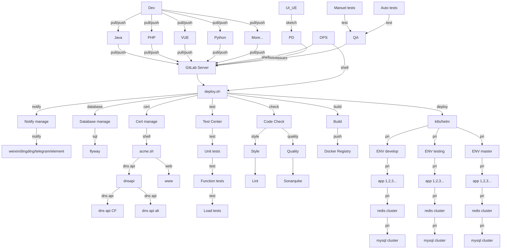

```mermaid
graph TB;

Dev -- pull/push --> Java;
Dev -- pull/push --> PHP;
Dev -- pull/push --> VUE;
Dev -- pull/push --> Python;
Dev -- pull/push --> more[More...];
Java -- pull/push --> GIT;
PHP -- pull/push --> GIT;
VUE -- pull/push --> GIT;
Python -- pull/push --> GIT;
more -- pull/push --> GIT;
GIT --> CICD[deploy.sh];
OPS -- shell --> GIT;
OPS -- shell --> CICD;
UI_UE -- sketch --> PD;
PD -- issues --> GIT[GitLab Server];
QA -- issues--> GIT;
testm[Manuel tests] -- test--> QA;
testa[Auto tests] -- test--> QA;
CICD -- deploy --> K8S[k8s/helm];
CICD -- build --> Build;
CICD -- database --> db1[Database manage];
CICD -- cert --> cert[Cert manage];
CICD -- notify --> notify[Notify manage];
CICD -- check --> rev[Code Check];
CICD -- test --> test[Test Center];
notify -- notify --> weixin/dingding/telegram/element;
db1 -- sql --> flyway;
cert -- shell --> acme[acme.sh];
acme -- dns api --> dnsapi;
acme -- web --> www;
dnsapi -- dns api --> dns1[dns api CF];
dnsapi -- dns api --> dns2[dns api ali];
test -- test --> testu[Unit tests];
testu -- test --> testf[Function tests];
testf -- test --> testl[Load tests];
rev -- style --> format[Style];
format --> Lint;
rev -- quality--> quality[Quality];
quality --> Sonarqube;
Build -- push --> Repo[Docker Registry];
K8S -- pri --> ENV_D[ENV develop];
K8S -- pri --> ENV_T[ENV testing];
K8S -- pri --> ENV_M[ENV master];
ENV_D -- pri --> app_d[app 1,2,3...];
app_d -- pri --> cache_d[redis cluster];
cache_d -- pri --> db_d[mysql cluster];
ENV_T -- pri --> app_t[app 1,2,3...];
app_t -- pri --> cache_t[redis cluster];
cache_t -- pri --> db_t[mysql cluster];
ENV_M -- pri --> app_m[app 1,2,3...];
app_m -- pri --> cache_m[redis cluster];
cache_m -- pri --> db_m[mysql cluster];
```
