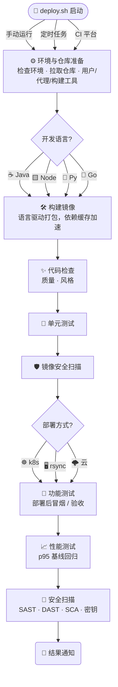

# deploy.sh

<p align="center">
<a href="https://github.com/xiagw/deploy.sh/actions"></a>
</p>

> 开源持续集成/发布系统。强大而灵活，支持多种开发语言与部署方式，可单独运行或与其它 CI/CD 工具集成，手动与自动发布皆可，支持 GitLab、GitLab-Runner、Gitea/Act_Runner、Jenkins、crontab、Screen/tmux 等多种运行方式。

## 功能介绍

<div class="feat-grid">

<div class="feat-card">
<div class="feat-ic">🎨</div>
<b>代码规范</b>
<span>phpcs · eslint · pylint · gofmt · rustfmt · ktlint · shfmt · hadolint · dotnet format</span>
</div>

<div class="feat-card">
<div class="feat-ic">🛡️</div>
<b>质量与安全</b>
<span>SonarQube · PMD · SpotBugs · Semgrep(SAST) · Trivy(SCA) · Gitleaks · ZAP · Vulmap(DAST)</span>
</div>

<div class="feat-card">
<div class="feat-ic">🧪</div>
<b>单元测试</b>
<span>phpunit · mvn/gradle test · npm test · pytest · go test，自动调用 + 覆盖率</span>
</div>

<div class="feat-card">
<div class="feat-ic">🔨</div>
<b>构建打包</b>
<span>npm build · composer · maven/gradle · docker build(buildx/bake/多架构) · pip</span>
</div>

<div class="feat-card">
<div class="feat-ic">🚀</div>
<b>发布方式</b>
<span>rsync+ssh · rsync daemon · docker compose · ftp · sftp · kubectl/helm · 阿里云 OSS / FC</span>
</div>

<div class="feat-card">
<div class="feat-ic">🧮</div>
<b>功能 &amp; 性能测试</b>
<span>部署后冒烟/验收 · JMeter *.jmx · k6（含 p95 基线回归对比）</span>
</div>

<div class="feat-card">
<div class="feat-ic">📣</div>
<b>发布通知</b>
<span>企业微信 · Telegram · Element(Matrix) · Email · Zoom · 飞书</span>
</div>

<div class="feat-card">
<div class="feat-ic">🔐</div>
<b>证书 &amp; 云平台</b>
<span>acme.sh 自动续期 HTTPS · AWS · Aliyun · Qcloud · Huaweicloud</span>
</div>

</div>

## 安装

前置条件：Git、Bash shell、SSH（可选，用于远程部署）。

```bash
git clone --depth 1 https://github.com/xiagw/deploy.sh.git $HOME/runner
```

## 语言探测

deploy.sh 按仓库文件自动识别开发语言，也可用 README 中的 `project_lang=` 行显式指定：

| 图标 | 语言 | 探测方式 |
|:--:|------|----------|
| ☕ | java | `pom.xml` / `build.gradle` / `gradle.build` 或 README 含 `project_lang=java` |
| 🐘 | php | `composer.json` 或 README 含 `project_lang=php` |
| 🟨 | node | `package.json` 或 README 含 `project_lang=node` |
| 🐍 | python | `requirements.txt` / `setup.py` / `Pipfile` 或 README 含 `project_lang=python` |
| 🐹 | golang | `go.mod` 或 README 含 `project_lang=golang` |
| 🦀 | rust | `Cargo.toml` 或 README 含 `project_lang=rust` |
| 🟣 | dotnet | `*.csproj` 或 README 含 `project_lang=dotnet` |
| 💎 | ruby | `Gemfile` / `*.gemspec` 或 README 含 `project_lang=ruby` |
| ✨ | elixir | `mix.exs` 或 README 含 `project_lang=elixir` |
| 🧩 | 其他 | README 含 `project_lang=[other]` |

> 说明：以下标记行供 deploy.sh 将本仓库识别为 shell 项目：`project_lang=shell`

## 流程图



## 快速开始

### 方式 [1] 手动单独运行

```bash
## 项目仓库已存在，直接运行
$HOME/runner/deploy.sh -w /path/to/<your_project.git>
# 或进入仓库目录
cd /path/to/<your_project.git> && $HOME/runner/deploy.sh
## 项目仓库不存在，用 deploy.sh 克隆
$HOME/runner/deploy.sh --git-clone https://github.com/<name>/<project>.git
```

### 方式 [2] crontab 或 Screen/tmux 自动运行

```bash
## crontab
*/5 * * * * for d in /path/to/src/*/; do (cd $d && git pull && $HOME/runner/deploy.sh --cron); done
## screen / tmux
while true; do for d in /path/to/src/*/; do (cd $d && git pull && $HOME/runner/deploy.sh --loop); done; sleep 300; done
```

### 方式 [3] 配合 GitLab-Runner

1. 准备 Gitlab 服务器与 gitlab-runner 服务器，[安装并注册](https://docs.gitlab.com/runner/install/linux-manually.html)（executor 为 shell），`sudo gitlab-runner status` 确认运行。
2. 参考 `conf/templates/gitlab-ci.yml`，在应用仓库创建 `.gitlab-ci.yml`。
3. 注意：环境配置 `data/deploy.env` 与项目配置 `data/conf/namespace/project-name.json` 首次运行自动从模板生成，**必须修改自定义配置（hosts、user、port、rsync_dest 等）**后才能部署。

### 方式 [4] 配合 Jenkins

1. Create job。
2. 设置任务，运行自定义 shell：`bash $HOME/runner/deploy.sh`。

## FAQ

- **如何创建 helm 项目文件**：若用 helm 部署到 k8s，chart 会在部署过程中缺失时自动生成（默认开启 8080 与 8081 端口）。
- **如何解决 gitlab-runner 运行失败**：假如你使用 Ubuntu，`rm -f $HOME/.bash_logout`。
