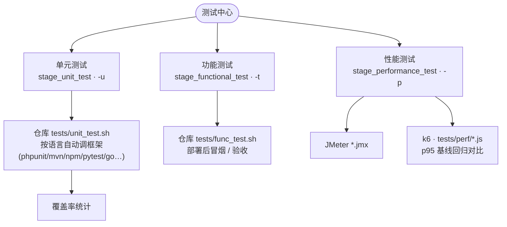

# 测试模块（lib/test.sh）

> 描述 deploy.sh 的测试能力：单元测试、功能测试、性能测试三层的触发方式、
> 框架探测、覆盖率统计与性能基线机制。本文档同时是 `lib/test.sh` 的设计注释。
>
> 适用范围：`deploy.sh` + `lib/test.sh`（-u/-t/-p 三个 CLI 标志及对应 stage）。

---

## 1. 三层测试模型

| 层级 | stage | CLI | CI 环境变量 | 内容 |
|---|---|---|---|---|
| 单元测试 | `stage_unit_test` | `-u/--test-unit` | `PIPELINE_UNIT_TEST=true` | 项目自带脚本 + 按语言调用测试框架（含覆盖率） |
| 功能测试 | `stage_functional_test` | `-t/--test-function` | `PIPELINE_FUNCTION_TEST=true` | 项目自带 `tests/func_test.sh`（冒烟/验收） |
| 性能测试 | `stage_performance_test` | `-p/--test-performance` | `PIPELINE_PERF_TEST=true` | JMeter `*.jmx` + k6 脚本，含基线对比 |

**触发规则（三者一致）**：CLI 标志或 CI 环境变量任一触发即运行；
**auto 模式（无参数运行 deploy.sh）默认全部跳过**，需显式触发，避免自动化流水线被测试意外中断。



---

## 2. 单元测试（test_unit）

执行顺序：

1. **项目自带脚本**：`$G_REPO_DIR/tests/unit_test.sh` → `$G_DATA/tests/unit_test.sh`，任一存在即逐个 `bash` 执行，失败即失败。
2. **语言测试框架**（`_framework_unit_cmd`，按 `detect_repo_language` 探测）：

   | 语言 | 命令（依次回退） |
   |---|---|
   | php | `vendor/bin/phpunit` → `phpunit` |
   | node | `npm test`（package.json 含 `"test"` script） |
   | java | `mvnw test` → `mvn test`（pom.xml）；`gradlew test` → `gradle test`（build.gradle） |
   | python | `python3 -m pytest`（pytest 已安装） |
   | golang | `go test ./...` |
   | rust | `cargo test` |
   | dotnet | `dotnet test` |
   | ruby | `bundle exec rspec` |
   | elixir | `mix test` |

   工具未安装/不可用时跳过该框架，不阻断。

### 覆盖率（`_framework_unit_cov`）

优先使用带覆盖率的框架命令，输出 `data/reports/coverage/<repo>-<lang>.txt`：

| 语言 | 覆盖率命令 | 前置条件 |
|---|---|---|
| golang | `go test -coverprofile=... && go tool cover -func=...` | go 可用 |
| python | `python3 -m pytest --cov=. --cov-report=term-missing` | pytest-cov 已安装 |
| node | `npm test -- --coverage` | jest/vitest 等支持 `--coverage` |
| php | `phpunit --coverage-text` | 已加载 xdebug/pcov |
| dotnet | `dotnet test --collect:"XPlat Code Coverage"` | dotnet 可用 |

java/rust/ruby 无内置零成本覆盖率，不注入参数（分别需要 jacoco 插件、
llvm-cov、simplecov，由项目自行配置）。

---

## 3. 功能测试（test_function）

运行项目自带脚本 `tests/func_test.sh` / `func_test.sh`，语义为**部署后的冒烟/验收**。
配合 gitlab-ci 模板的 `smoke` 阶段使用（见 `conf/templates/gitlab-ci.yml`）。

---

## 4. 性能测试（test_performance）

计划探测（`_perf_find_plans`）：

| 引擎 | 识别规则 |
|---|---|
| jmeter | 仓库内 `*.jmx`（maxdepth 2） |
| k6 | `tests/perf/*.js` 或 `*.k6.js`（maxdepth 3） |

无任何计划时跳过。工具缺失时自动安装：jmeter → `_install_jmeter`（common.sh），
k6 → `_install_k6`（common.sh，GitHub releases 单二进制）。

### 4.1 JMeter

```
jmeter -n -t <plan>.jmx -l data/reports/perf/<name>.jtl -e -o data/reports/perf/<name>
```

生成 HTML 报告目录与原始 .jtl。

### 4.2 k6 与基线对比（`_run_k6` / `_k6_baseline_check`）

```
k6 run --out json=data/reports/perf/<name>.json <script>.js
```

- **报告**：`data/reports/perf/<name>.json`（k6 JSON 输出）
- **历史归档**：每次运行复制到 `data/reports/perf/history/<name>-<时间戳>.json`
- **基线**：`data/reports/perf/<name>.baseline.json`，记录最近一次 `http_req_duration` 的 p95
  - 首次运行：写入基线，提示 `baseline saved`
  - 后续运行：与基线比较，**超过 20% 视为回归**（warn），否则 `baseline OK`
  - 每次运行后刷新基线为本次结果

> 基线文件是「上次结果」，用于前后两次对比趋势；历史归档保留完整数据可供报表/图表回溯。
> 无 `http_req_duration` 指标（如纯逻辑脚本）时跳过基线对比。

---

## 5. 产物目录（data/reports）

```
data/reports/
├── coverage/
│   └── <repo>-<lang>.txt       # 单元测试覆盖率文本报告
└── perf/
    ├── <name>.json             # k6 最新结果
    ├── <name>.baseline.json    # k6 基线（p95）
    ├── <name>.jtl              # JMeter 原始数据
    ├── <name>/                 # JMeter HTML 报告
    └── history/
        └── <name>-<时间戳>.json # 历史归档
```

---

## 6. 接入 CI

`conf/templates/gitlab-ci.yml` 已含示例：`test`（单元）、`smoke`（功能，部署后）、
`perf`（性能，`when: manual`）三个阶段。推荐用法：

- 单元测试：每个 merge request / push 触发（`when: always`）
- 功能测试：部署后触发（`stage: smoke`）
- 性能测试：发布前手动或定时触发（`when: manual`），配合基线监控回归
