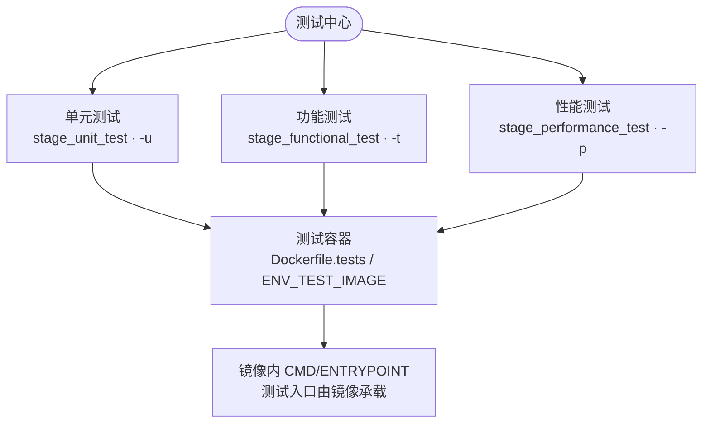

# 测试模块（lib/test.sh）

> 描述 deploy.sh 的测试能力：单元测试、功能测试、性能测试三层的触发方式与容器化执行链路。
> 本文档同时是 `lib/test.sh` 的设计注释。
>
> 适用范围：`deploy.sh` + `lib/test.sh`（-u/-t/-p 三个 CLI 标志及对应 stage）。

---

## 1. 三层测试模型

| 层级 | stage | CLI | CI 环境变量 |
|---|---|---|---|
| 单元测试 | `stage_unit_test` | `-u/--test-unit` | `PIPELINE_UNIT_TEST=true` |
| 功能测试 | `stage_functional_test` | `-t/--test-function` | `PIPELINE_FUNCTION_TEST=true` |
| 性能测试 | `stage_performance_test` | `-p/--test-performance` | `PIPELINE_PERF_TEST=true` |

**触发规则（三者一致）**：CLI 标志或 CI 环境变量任一触发即运行；
**auto 模式（无参数运行 deploy.sh）默认全部跳过**，需显式触发，避免自动化流水线被测试意外中断。



---

## 2. 容器化执行方式

三个测试层**共用同一套容器化逻辑**，deploy.sh 只负责「构建镜像 + 运行容器」，不做框架探测、不提供模板、不依赖 runner 系统环境。

### 2.1 镜像来源（`_test_resolve_image`）

优先级：

1. `ENV_TEST_IMAGE`：显式指定镜像（不构建）
2. 仓库根 `Dockerfile.tests`：自动 `docker build`（tag: `deploy-test:<repo>-<short-sha>`，已存在则复用）
3. 都没有 → 测试阶段跳过，提示「无测试镜像」

镜像的测试**入口由镜像自行定义**（`CMD` / `ENTRYPOINT`），例如：

```dockerfile
# Dockerfile.tests 示例（单元测试）
FROM node:22-bookworm
COPY tests/ /tests/
CMD ["bash", "/tests/run-all.sh"]
```

deploy.sh 运行容器时不传命令，直接执行镜像默认 CMD。

### 2.2 运行参数（`_test_docker_cmd`）

```
docker run --rm -u 1000:1000 \
  -v <G_REPO_DIR>:/app -w /app \
  -v <G_DATA>/reports:/reports \
  [--network host]          # ENV_TEST_NETWORK=host 时加
  <image>
```

- 仓库挂载为 `/app`（测试脚本/被测代码所在）
- `data/reports` 挂载为 `/reports`（镜像内测试报告写到 `/reports/coverage/` 等即可持久化）
- 默认网络隔离；功能测试需访问被测服务/数据库时设 `ENV_TEST_NETWORK=host`

---

## 3. 阶段级说明

### 3.1 单元测试（test_unit）

构建/复用测试镜像，`docker run` 执行。镜像内可预装任意语言框架
（phpunit / npm test / mvn test / pytest / go test / cargo test / rspec 等），
测试脚本与覆盖率命令均由镜像承载，报告写入 `/reports/coverage/`。

### 3.2 功能测试（test_function）

同样容器执行，语义为**部署后的冒烟/验收**。
配合 gitlab-ci 模板的 `smoke` 阶段使用（见 `conf/templates/gitlab-ci.yml`）。

### 3.3 性能测试（test_performance）

同为容器执行，性能引擎（k6 / jmeter 等）由镜像承载，测试计划/脚本与基线对比逻辑
全部在镜像内部实现。deploy.sh 不做计划探测。

---

## 4. 产物目录（data/reports）

```
data/reports/
└── coverage/                # 容器内 /reports/coverage 写入的测试报告
```

具体文件布局由镜像内的测试脚本决定（deploy.sh 只保证挂载目录可写）。

---

## 5. 接入 CI

`conf/templates/gitlab-ci.yml` 已含示例：`test`（单元）、`smoke`（功能，部署后）、
`perf`（性能，`when: manual`）三个阶段。推荐用法：

- 单元测试：每个 merge request / push 触发（`when: always`）
- 功能测试：部署后触发（`stage: smoke`）
- 性能测试：发布前手动或定时触发（`when: manual`）

> 三阶段均需仓库提供 `Dockerfile.tests`（或 CI 侧注入 `ENV_TEST_IMAGE`）才会实际执行。